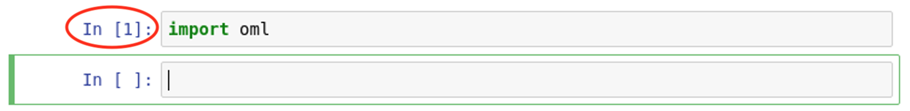

# Automatic Machine Learning with Python

Machine learning today has made its way into the enterprise domain. However, the traditional ML process is human-dependent, and not all businesses have the resources to invest in an experienced data science team. AutoML may be the answer to such situations.

**Automatic Machine Learning (AutoML)** is the process of automating the end-to-end process of applying machine learning to real-world problems. The purpose of AutoML is to automate the repetitive tasks like feature selection, model selection and model tuning, so that data scientists can actually spend more time on the problem at hand. AutoML essentially brings machine learning in the hands of people who have no major expertise in this field.

Oracle Machine Learning for Python has the following AutoML capabilities:

- **Automatic Feature Selection** that reduces the size of the original feature set to help speed-up model training and tuning, without compromising on model quality.

- **Automatic Model Selection** that selects the appropriate machine learning algorithm from the supported Oracle Advanced Analytics algorithms.

- **Automatic Model Tuning** that tunes the model hyperparameters to maximize the scoring metric selected from the several scoring metrics supported for the model.

AutoML performs those common data scientist tasks automatically, with less effort and potentially better results. It also leverages the parallel processing and scalability of Oracle Database and machine learning techniques to minimize execution time while producing high-quality results.

## Before You Begin

### Objectives

This lab highlights the automatic machine learning feature of Oracle Machine Learning for Python.

- Use AutoML's Automatic Feature Selection to reduce features in the dataset
- Demonstrate the use of Automatic Model Selection
- Use AutoML's Automatic Model Tuning

### Requirements

To complete this lab, you need the following account credentials and assets:

- Oracle Cloud Infrastructure Console login credentials and tenancy name
- Public IP Address and login credentials of the lab virtual machine (VM) for the hands-on exercises

## **STEP 0** : Create a New Jupyter Notebook

>**Note** : If like to use a prebuilt Jupyter notebook for this lab (so you don't have to copy/paste commands from this manual), proceed directly to the section **"How to run the lab steps using a pre-built Jupyter Notebook?"** in the **Appendix**.

1. In the lab VM, ensure that the notebook server is started and the dashboard is displayed as follows:


2. Create a new Jupyter notebook. Click on the  button at the top right and select the  kernel from the dropdown as shown below.


3. Or, if you are in another notebook, you need to click **File** -> **New Notebook** -> **Python3** as follows:


4. You will be presented a blank notebook.


5. To use **Oracle Machine Learning for Python**, you must first import the ***oml*** Python module which contains the routines of OML4Py.

>**Note** : The ***oml*** module depends on few other Python modules, including ***cx_Oracle***, which is the module that enables Oracle Database access from Python.

6. Copy the below **"import oml"** Python statement by clicking the  button.

````
<copy>import oml</copy>
````

7. Paste the code in a blank cell of the notebook. Note the cell will be in **Edit mode** when the border is green.


8. Run the statement by clicking the  button. This will run the statement in the box where the cursor is currently active.

9. After the statement is run, a new blank cell created and the cell that was run get a number assigned in square brackets, and the green border moves to the next cell.



10. Unless you plan on using the prebuilt Jupyter notebooks, please continue to use the above method of copying/pasting Python commands from the lab manual to the Jupyter notebook session in the lab VM.

## **STEP 1** : Automatic Feature Selection

In a data analytics application, feature selection is a critical stage in data preprocessing that has a high impact on both runtime and model performance. It is the process of taking a dataset and constructing explanatory features that can be used to train a machine learning model for a prediction problem.

The traditional approach to feature selection is to manually build the features using domain knowledge and statistical analysis, which is tedious, time-consuming, and error prone. Moreover, the steps for feature engineering may need to be re-written for each new dataset.

**Automatic Feature Selection**, a component of OML4Py's **Automatic Machine Learning (AutoML)**, improves upon this standard workflow by automatically extracting useful and meaningful features from a set of related data, using a framework that can be applied to any problem. It cuts down on the time spent in feature selection and ideally, should be made a standard part of any machine learning workflow.

Automatic feature selection uses several feature-ranking algorithms to identify the best feature subset that reduces model training time without compromising model performance. Oracle advanced meta-learning techniques quickly prune the search space of this feature selection optimization.

Automatic feature selection is handled by **oml.automl.FeatureSelection** class, which takes in a data set and the Oracle Advanced Analytics algorithm on which to test the feature reduction. For information on the parameters and methods of the class, you may invoke **help(oml.automl.FeatureSelection)**.

>**Note** : Oracle AutoML Automatic Feature Selection currently supports **Classification** algorithms.

### 1.1. Load and Explore a Dataset

To demonstrate **Automatic Feature Selection** we will use a labeled dataset for predicting product backorders which was sourced from "Can You Predict Product Backorders?" dataset from Kaggle. Predicting whether the product will be backordered based on past sales, is a Classification problem with binary outcome.

> The dataset was prepared for the purposes of this lab, mainly that the null values were replaced with estimated samples, character data was transformed to numeric, and irrelevant features and rows were removed.

1. Load the dataset from the CSV file using ***read\_csv()*** function in Pandas. It is also important to shuffle the dataset to reset the order of records in case the datafile was ordered prior to creation.

````
<copy>import pandas as pd

# Import data from file
df = pd.read_csv('/home/oracle/OML4Py/datasets/backorders/backorders_250k.csv')

# Shuffle the data so the ordering is random
df = df.sample(frac=1).reset_index(drop=True)</copy>
````

2. Connnect to the Oracle Database using ***oml.connect()*** with **automl=True**. This is required in order to enable a connection for Automatic Machine Learning.

>**Note** : An AutoML enabled connection uses database-resident connection pooling, which means that the database administrator must have first activated database-resident connection pooling for the connection to be successful. This setup has already been performed for this lab.

````
<copy>import warnings
warnings.filterwarnings('ignore')

import oml
from oml import automl
from oml import algo
from oml.automl import FeatureSelection
import time

oml.connect("labuser", "labuser", host="localhost", port=1521, service_name="pdb", automl=True)
oml.isconnected()</copy>
````

3. Load the data in Oracle into a table named **BACKORDERS**.

````
<copy>try:
    oml.drop(table="BACKORDERS")
except:
    pass
oml_df = oml.create(df, table="BACKORDERS")</copy>
````

4. Get to know the data - check the feature columns and target. Note that there are **21** features in this dataset, the labeled target being **went\_on\_backorder**. Also note that not all features may be required for prediction as some may not be correlated with the target.

````
<copy>oml_df.columns</copy>
````

5. Describe the data to get descriptive statistics on the columns in the dataset, including data distribution, std deviation, min, max and counts.

````
<copy>oml_df.describe()</copy>
````

### 1.2. Get Baseline Performance with All Features

Let's first check the baseline performance of **SVM** classification using all the features in the dataset.

1. Split the dataset into **train/test** with a ratio of **80/20** using stratified sampling, in which all columns will be used to preserve data distribution after the splits.

    Also, separate the predictors and targets for testing and training into **train\_x**, **train\_y** and **test\_x**, **test\_y**, respectively.

````
<copy># Split the data set into train and test.
train, test = oml_df.split(ratio=(0.8, 0.2), strata_cols=oml_df.columns)

# Separate the predictors and targets for test and train.
train_x, train_y = train.drop('went_on_backorder'), train['went_on_backorder']
test_x, test_y = test.drop('went_on_backorder'), test['went_on_backorder']</copy>
````

2. Build the SVM prediction model using **oml.svm** on training data. Also capture the model build time for later comparisons.

````
<copy>start_time = time.time()

mod = oml.svm(mining_function='classification').fit(train_x, train_y)

orig_time = time.time()-start_time
orig_features = len(train_x.columns)</copy>
````

3. Get the SVM model's **Accuracy** metric on the test set using the **score** function. The score function returns the mean accuracy for classification algorithms.

````
<copy>orig_accuracy = mod.score(test_x, test_y)</copy>
````

4. Print the model training statistics, including accuracy and build time.

````
<copy>print ("Metrics WITHOUT Automatic Feature Selection")
print ("-------------------------------------------")

print ("Total features trained: %d" % orig_features)
print ("Model training time: %d secs" % orig_time)
print ("Model accuracy: %.4f" % orig_accuracy)</copy>
````

### 1.3. Using Automatic Feature Selection

Automatic Feature Selection evaluates the performance of various features in the dataset, identifying the best features or feature subsets that reduce the model training time without compromising on model performance.

Oracle has advanced meta-learning techniques that quickly prunes the search space by applying several ranking algorithms given a training dataset and the ML algorithm, which enables even a novice user to create hundreds of relevant features very quickly from the dataset.

1. Automatic Feature Selection is initialized using **automl.FeatureSelection** class. You can specify the **score\_metric**, which for classification is the prediction **Accuracy**. You can also use the parallel clause to specify database parallelism to speed-up processing.

````
<copy>fs = automl.FeatureSelection(mining_function='classification', score_metric='accuracy', parallel=4)</copy>
````

2. Get the reduced feature subset on the training set by invoking the ***reduce()*** method. Note that you specify the ML algorithm for classification which in this case is **svm\_linear**.

````
<copy>start_time = time.time()

subset = fs.reduce('svm_linear', train_x, train_y)

automl_time = time.time() - start_time
reduced_features = len(subset)</copy>
````

3. Train a SVM model using the reduced feature set discovered by automatic feature selection.

````
<copy>new_train_x = train_x[:, subset]
new_test_x = test_x[:, subset]

start_time = time.time()

mod = oml.svm(mining_function='classification').fit(new_train_x, train_y)

reduced_time = time.time() - start_time
reduced_accuracy = mod.score(new_test_x, test_y)</copy>
````

4. Print the model accuracy and training time, along with the gain in feature reduction.

````
<copy>print ("Metrics WITH Automatic Feature Selection")
print ("----------------------------------------")
print ("Feature reduction obtained: %dx" % (orig_features/reduced_features))
print ("Model training time: %d secs (gain %.2f%%)" % (reduced_time, (reduced_time*100/orig_time)))
print ("Model accuracy: %.4f (original %.4f)" % (reduced_accuracy, orig_accuracy))</copy>
````

5. Graph the performance metrics for visual comparison. Notice that with Automatic Feature Selection, the training time is reduced without compromising on accuracy.

````
<copy>import matplotlib.pyplot as plt
import numpy as np

# Model Creation Time
objects = ('Original','Automatic Feature Selection')
y_pos = np.arange(len(objects))
performance = [orig_time, reduced_time]

plt.bar(y_pos, performance, align='center', alpha=0.5, color=['green','red'])
plt.xticks(y_pos, objects)
plt.ylabel('Model Creation Time (secs)')
plt.title('Automatic Feature Selection')
plt.show()

# Model Accuracy
objects = ('Original','Automatic Feature Selection')
y_pos = np.arange(len(objects))
performance = [orig_accuracy, reduced_accuracy]

plt.bar(y_pos, performance, align='center', alpha=0.5, color=['green','red'])
plt.xticks(y_pos, objects)
plt.ylabel('Accuracy')
plt.title('Model Accuracy')
plt.show()

# Model Feature Reduction
objects = ('Original','Automatic Feature Selection')
y_pos = np.arange(len(objects))
performance = [orig_features, reduced_features]

plt.bar(y_pos, performance, align='center', alpha=0.5, color=['green','red'])
plt.xticks(y_pos, objects)
plt.ylabel('# of Features')
plt.title('Feature Reduction')
plt.show()</copy>
````

## **STEP 2** : Automatic Model Selection

Selecting the best data mining algorithm for a dataset is not trivial as no single algorithm works best for all ML problems. Moreover, some algorithms favor a different way of engineering the features which further complicates the task especially when the features may need to be re-engineered for each algorithm.

Oracle Machine Learning's **Automatic Model Selection** comes to the rescue. With Automatic Model Selection, the best model from a set of supported machine learning models is selected just by using the characteristics of the dataset and the ML task.

This capability is achieved through Oracle's advanced meta-learning intelligence which suggests the best model for a dataset by evaluating only a few models. This is possible through the knowledge base that Oracle has built by learning the metadata from a repertoire of datasets.

> OML4Py **Automatic Model Selection** currently supports classification algorithms.

1. Load the breast cancer dataset into the database with a unique **case id** column for reproducibility.

````
<copy># Import datasets from sklearn
from sklearn import datasets

# Load the dataset
bc = datasets.load_breast_cancer()
bc_data = bc.data.astype(float)

# Separate the data and features
X = pd.DataFrame(bc_data, columns = bc.feature_names)
y = pd.DataFrame(bc.target, columns = ['TARGET'])

# Add the case_id column and push the local data to the database
row_id = pd.DataFrame(np.arange(bc.data.shape[0]), columns = ['CASE_ID'])

# Drop the BREASTCANCER table if it exsts
try:
    oml.drop(table="BREASTCANCER")
except:
    pass

oml_df = oml.create(pd.concat([row_id, X, y], axis=1), table = 'BREASTCANCER')</copy>
````

2. Split the dataset in to test and train.

````
<copy># split the dataset into test and train
train, test = oml_df.split(ratio=(0.8, 0.2), seed = 1234)

# Separate the predictors and the target
train_x, train_y = train.drop('TARGET'), train['TARGET']
test_x, test_y = test.drop('TARGET'), test['TARGET']</copy>
````

3. Use the **automl.ModelSelection** class of OML4Py to invoke automatic model selection capabilities.

    With oml.automl.ModelSelection class, you specify a dataset and the number of algorithms you like to tune. The result set returned is a ranked list of models that are predicted to perform the best on the given dataset.

    For information on the parameters and methods of the class, invoke help(oml.automl.ModelSelection).

> The following metrics are supported for measuring binary Classification algorithm performance in automatic model selection: **accuracy**, **f1**, **precision**, **recall**, **roc\_auc**, **f1\_micro**, **f1\_macro**, **f1\_weighted**, **recall\_micro**, **recall\_weighted**, **precision\_micro**, **precision\_macro** and **precision\_weighted**

4. Create an automatic model selection object with **f1\_macro** as the score metric.

````
<copy>ms = automl.ModelSelection(mining_function='classification', score_metric='f1_macro', parallel=4)</copy>
````

5. Run the model selection using the **select()** method to get the top (k=1) predicted algorithm (defaults to tuned model).

>The **select()** method accepts the following parameters.
>
>    * **k**: Returns the top k best models. Use k=1 to return only the top model.
>    * **tune**: Tune the top **k** best models.
>    * **solver**: When set to **exhaustive**, the model selection process thoroughly searches the model space and identifies the best model. When **fast**, predictive techniques are used in identifying the best model.

````
<copy>select_model = ms.select(train_x, train_y, case_id='CASE_ID', k=1)</copy>
````

6. Show the selected and tuned model.

````
<copy>select_model</copy>
````

7. Score on the selected and the tuned model.

````
<copy>"{:.2}".format(select_model.score(test_x, test_y))</copy>
````

8. Perform a fast model selection on the training data without tuning (using tune=False). This predicts the top 3 models and their respective scores.

````
<copy>ms.select(train_x, train_y, tune=False)</copy>
````

## **STEP 3** : Automatic Model Tuning

Machine learning algorithms take a set of parameters as input to guide their behavior when generating the models. The task of choosing the right set of parameters and tuning them to achieve the best combination that scores the maximum accuracy, relies heavily on the expertise of the data scientist. Typically, many tedious hours are spent over the course of several iterations to arrive at optimal parameter values.

**Automatic Model Tuning** automates this process using a highly-parallel, asynchronous and gradient-based hyperparameter optimization algorithm to tune the parameters of various machine learning algorithms. It takes advantage of the processing power of the Oracle Database to test the different parameter configurations while training the model. It can automatically generate optimal combinatorial values of the parameters that maximize the prediction accuracy on a given dataset.

> OML4Py **Automatic Model Tuning** supports classification and regression functions.

1. Automatic model tuning in OML4Py is provided by the **oml.automl.ModelTuning** class. To use the oml.automl.ModelTuning class, you specify a dataset and an Oracle Advanced Analytics algorithm. The tuned model with its corresponding hyperparameters are returned.

    For the advanced user, the class allows a customized hyperparameter search space and a non-default scoring metric, among a few other parameters, to influence the "black-box" behavior.

> For information on the parameters and methods of the class, invoke help(oml.automl.ModelTuning)

2. Start an automatic model tuning task on the Breast Cancer dataset using the Decision Tree algorithm.

    Invoke the **tune()** method of **modelTuning** to start the tuning process. Specify **accuracy** as the **score\_metric**, which is generally the preferred metric to measure Classification performance.

    The return resultset of **tune()** is an object that contains:
    * **'best\_model'**: Best tuned model ready for inference
    * **'all\_evals'**: List of all hyperparameters tried and their corresponding scores (default 4)

````
<copy>at = automl.ModelTuning(mining_function='classification', parallel=4)
results = at.tune('dt', train_x, train_y, case_id='CASE_ID', score_metric='accuracy')</copy>
````

3. Show the tuned model details.

````
<copy>tuned_model = results['best_model']
tuned_model</copy>
````

4. Show the **accuracy** score of the tuned model and the corresponding hyperparameters.

````
<copy>score, params = results['all_evals'][0]
print ("Score for the rf model with the best parameters: %.4f" % score)</copy>
````

5. Retrieve the hyperparameter values from the resultset.

````
<copy>sorted(params.items())</copy>
````

6. Invoke the tuning task once again but this time specify a user-defined search space using the **param\_space** parameter of **tune()**. This allows you to influence the optimization process by providing search ranges for the hyperparameters (default is none, which means all values are explored).

    Typical use of the search space is when you have developed an understanding on the dataset and know that certain parameter values are simply out of range and need not be explored.

````
<copy>search_space={'RFOR_SAMPLING_RATIO': {'type': 'continuous', 'range': [0.05, 0.5]},
              'RFOR_NUM_TREES': {'type': 'discrete', 'range': [50, 55]},
              'TREE_IMPURITY_METRIC': {'type': 'categorical', 'range': ['TREE_IMPURITY_ENTROPY', 'TREE_IMPURITY_GINI']},}</copy>
````

````
<copy>results = at.tune('rf', train_x, train_y,
                  score_metric='f1_macro', param_space = search_space)</copy>
````

7. Show **f1\_score** score of the tuned model and the corresponding hyperparameters.

````
<copy>score, params = results['all_evals'][0]
print ("Score for the rf model with the best parameters: %.4f" % score)</copy>
````

````
<copy>sorted(params.items())</copy>
````

## Summary

As demonstrated in this lab, AutoML performs common data science tasks automatically, with less effort and potentially better results. It also leverages the parallel processing and scalability of the Oracle Database and machine learning techniques to minimize execution time while producing high-quality machine learning models.

## Appendix

### How to run this lab using a pre-built Jupyter Notebook?

Follow the below steps if you are short on time and choose to run the labs without copying/pasting the commands from this manual.

1. In the lab VM, ensure that the notebook server is started and the dashboard is displayed as follows:


2. Click on **saved_notebooks** to browse the folder that contains the saved Python notebooks.


> If you are in another notebook, or cannot locate the notebook dashboard, click **File** -> **Open**.
>
>

3. In the **saved-notebooks** folder click on **6-automl-python** lab.


4. You will be presented the notebook for this lab. Run the entire notebook by clicking **Kernel** -> **Restart and Run All**. This will run all executable statements of the notebook (i.e. in the Python statements in the cells).


5. Confirm that you like to **Restart and Run All Cells**. The notebook will take a few minutes to run.


6. After all cells of the notebook successfully complete, you will see that each cell will get a number assigned in square brackets and (optionally) an output will be shown (also ensure there were no errors).

  Post completion, confirm that the last few cells of your notebook looks similar to the following:


7. You have successfully executed the notebook. You may now go through the notebook steps and inspect the individual commands and their respective outputs.
