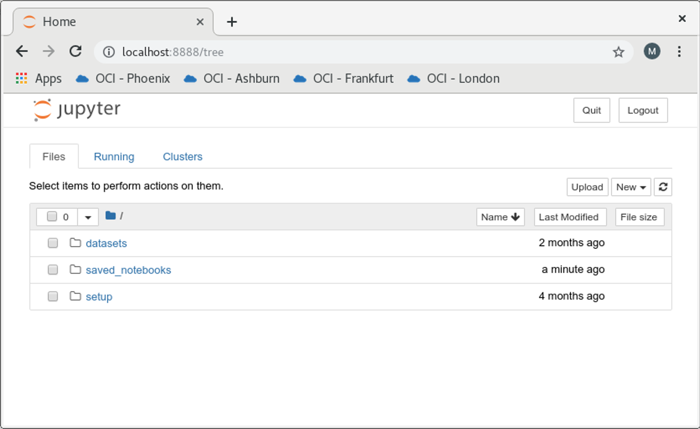

# Data Preparation and Exploration

**Oracle Machine Learning for Python** provides various methods and classes to perform exploratory analysis of database-resident data and apply best practice data preparation techniques in machine learning. .

The classes of various OML4Py objects contain methods that are overloaded to work like regular Python functions through the Transparency Layer, making it easier to prepare very large enterprise grade database-resident datasets for machine learning. OML4Py also provides methods for executing common statistical operations on the dataset, and allows you to graphically render the data in various types of charts.

This hands-on lab highlights the **OML4py Transparency Layer** and demonstrates that many familiar Python functions automatically translate to SQL and run inside the database for optimal performance and execution.

## Before You Begin

### Objectives

This lab highlights data preparation and exploration using Oracle Machine Learning for Python.

- **Data preparation** : Select, combine, split and clean data
- **Data exploration** : Correlate, cross-tabulate, mutate, sort and summarize data
- **Visual exploration** : Graphically explore database-resident data

### Requirements

To complete this lab, you need the following account credentials and assets:

- Oracle Cloud Infrastructure Console login credentials and tenancy name
- Public IP Address and login credentials of the lab virtual machine (VM) for the hands-on exercises

## **STEP 0** : Create a New Jupyter Notebook

>**Note** : If like to use a prebuilt Jupyter notebook for this lab (so you don't have to copy/paste commands from this manual), proceed directly to the section **"How to run the lab steps using a pre-built Jupyter Notebook?"** in the **Appendix**.

1. In the lab VM, ensure that the notebook server is started and the dashboard is displayed as follows:



2. Create a new Jupyter notebook. Click on the  button at the top right and select the  kernel from the dropdown as shown below.


3. Or, if you are in another notebook, you need to click **File** -> **New Notebook** -> **Python3** as follows:


4. You will be presented a blank notebook.


5. To use **Oracle Machine Learning for Python**, you must first import the ***oml*** Python module which contains the routines of OML4Py.

>**Note** : The ***oml*** module depends on few other Python modules, including ***cx_Oracle***, which is the module that enables Oracle Database access from Python.

6. Copy the below **"import oml"** Python statement by clicking the  button.

````
<copy>import oml</copy>
````

7. Paste the code in a blank cell of the notebook. Note the cell will be in **Edit mode** when the border is green.


8. Run the statement by clicking the  button. This will run the statement in the box where the cursor is currently active.

9. After the statement is run, a new blank cell created and the cell that was run get a number assigned in square brackets, and the green border moves to the next cell.


10. Unless you plan on using the prebuilt Jupyter notebooks, please continue to use the above method of copying/pasting Python commands from the lab manual to the Jupyter notebook session in the lab VM.

## **STEP 1** : Load a Sample Dataset in the Oracle Database

Load a sample dataset that will be used in this lab.

1. First, make a connection to the Oracle Database using ***oml.connect()*** and ensure that ***oml.isconnected()*** returns **True** after a successful connection.

````
<copy>import warnings
warnings.filterwarnings('ignore')

import oml
oml.connect("labuser","labuser", host="localhost", port=1521, service_name="pdb")

oml.isconnected()</copy>
````

2. Load the **iris** dataset from **sklearn.datasets**. Store the dataset in a temporary database table using ***oml.push()***, and return the OML DataFrame proxy object **OML_TMP** to the Python session.

> **Note** : The predictors and the target variables will be combined in one database table.

````
<copy>from sklearn.datasets import load_iris
import pandas as pd

iris = load_iris()

x = pd.DataFrame(iris.data, columns = ['SEPAL_LENGTH','SEPAL_WIDTH',
                                       'PETAL_LENGTH','PETAL_WIDTH'])
y = pd.DataFrame(list(map(lambda x: {0: 'setosa', 1: 'versicolor',
                          2:'virginica'}[x], iris.target)),
                 columns = ['Species'])
z = pd.concat([x, y], axis=1)

IRIS_TMP = oml.push(z)</copy>
````

## **STEP 2** : Data Preparation

### 2.1. Select Data

Data selection is a typical step in preparing data for analysis which involves selecting rows or columns, or filtering values of interest from a larger data set.

1. Select the first few or the last few rows in an OML DataFrame using the ***head()*** or ***tail()*** methods.

> When the number of rows is not supplied to head() and tail(), the default number of rows returned are **5**.

````
<copy># Display the first 5 rows.
IRIS_TMP.head()

# Display the first 10 rows.
IRIS_TMP.head(10)

# Display the last 5 rows.
IRIS_TMP.tail()

# Display the last 10 rows.
IRIS_TMP.tail(10)</copy>
````

2. Select all rows from the OML DataFrame **IRIS\_TMP** and filter columns using column names. In the following example, **IRIS\_projected1** selects only the **SEPAL\_LENGTH** and **PETAL\_LENGTH** columns of **IRIS\_TMP** (aka column projection).

````
<copy>IRIS_projected1 = IRIS_TMP[:, ["SEPAL_LENGTH", "PETAL_LENGTH"]]
IRIS_projected1.head(3)</copy>
````

3. Next, select all rows from **IRIS\_TMP** and select the columns using an index range. In the below example, **IRIS\_projected2** contains the first 3 columns of **IRIS\_TMP** selected using an index range of **[1:4]**.

````
<copy>IRIS_projected2 = IRIS_TMP[:, 1:4]
IRIS_projected2.head(3)</copy>
````

4. Select all rows from **IRIS\_TMP** and select all columns having the **oml.String** data type.

  Use the ***select\_type*** method with the ***include*** clause for this purpose.

````
<copy>IRIS_projected3 = IRIS_TMP.select_types(include=[oml.String])
IRIS_projected3.head(3)</copy>
````

5. Let's explore the various ways of filtering data in-database. First, select **SEPAL\_LENGTH** and **PETAL\_LENGTH** where **PETAL\_LENGTH** is less than **1.5**.

````
<copy>IRIS_filtered1 = IRIS_TMP[IRIS_TMP["PETAL_LENGTH"] < 1.5,
                                  ["SEPAL_LENGTH", "PETAL_LENGTH"]]
print("Length: ", len(IRIS_filtered1))
IRIS_filtered1.head(3)</copy>
````

6. Next, select all rows in which **PETAL\_LENGTH** is less than **1.5** or **SEPAL\_LENGTH** is **5.0**, using **AND** and **OR** conditions in filtering.

````
<copy>IRIS_filtered2 = IRIS_TMP[(IRIS_TMP["PETAL_LENGTH"] < 1.5) |
                          (IRIS_TMP["SEPAL_LENGTH"] == 5.0), :]
print("Length: ", len(IRIS_filtered2))
IRIS_filtered2.head(3)</copy>
````

7. Lastly, select all rows in which **PETAL\_LENGTH** is less than **1.5** and **SEPAL\_LENGTH** is greater than **5.0**.

````
<copy>IRIS_filtered3 = IRIS_TMP[(IRIS_TMP["PETAL_LENGTH"] < 1.5) &
                          (IRIS_TMP["SEPAL_LENGTH"] > 5.0), :]
print("Length: ", len(IRIS_filtered3))
IRIS_filtered3.head()</copy>
````

### 2.2. Combine Data

You can join data from OML DataFrame objects that represent database tables by using the ***append()***, ***concat()***, and ***merge()*** methods.

#### Append Data

1. Use the ***append()*** method to join two objects of the same data type. The below example appends the **oml.Float** series object **num1** to another **oml.Float** series object **num2**.

````
<copy>import pandas as pd

df = pd.DataFrame({"id" : [1, 2, 3, 4, 5],
                      "val" : ["a", "b", "c", "d", "e"],
                      "ch" : ["p", "q", "r", "a", "b"],
                      "num" : [4, 3, 6.7, 7.2, 5]})
OML_DF = oml.push(df)

print (df.dtypes)

num1 = OML_DF['id']
num2 = OML_DF['num']
num1.append(num2)</copy>
````

2. The below example appends an **oml.DataFrame** object to another **oml.DataFrame** object, the column types of which are the same.

````
<copy>x = OML_DF[['id', 'val']]
y = OML_DF[['num', 'ch']]

print("Types x:\n", x.dtypes)
print("Types y:\n", y.dtypes)

x.append(y)</copy>
````

#### Concatenate Data

3. Use the ***concat()*** method to combine columns from one object with those of another object. The first example combines the two oml.DataFrame objects x and y column-wise.

> To combine two objects with the ***concat()*** method, both objects must represent data from the same underlying database table, view, or query.

````
<copy>from collections import OrderedDict

x = OML_DF[['id', 'val']]
y = OML_DF[['num', 'ch']]
x.concat(y)</copy>
````

4. Next, create an oml.Float object with the rounded exponential of two times the values in the **num** column of the **OML\_DF** object, then concatenate it with the oml.DataFrame object **y** using a new column name **round(exp(2\*num))**.

````
<copy>w = (OML_DF['num']\*2).exp().round(decimals=2)
y.concat({'round(exp(2*num))':w})</copy>
````

5. Concatenate object **x** with multiple objects and turn on automatic name conflict resolution (using ***auto_name=True***), which will take care of duplicate column names across the objects when they are combined.

````
<copy>z = OML_DF[:,'id']
x.concat([z, w, y], auto_name=True)</copy>
````

6. You can also rename columns with a custom name by passing in a dictionary mapping of strings to objects, for example using ***OrderedDict()*** as in the following example.

````
<copy>x.concat(OrderedDict([('ID',z), ('round(exp(2*num))',w), ('New_',y)]))</copy>
````

#### Merge Data

Use the ***merge()*** method to join data from two objects.

7. In the first example, perform a cross join on the oml.DataFrame objects **x** and **y**, which creates the oml.DataFrame object **xy**.

````
<copy>x = OML_DF[['id', 'val']]
y = OML_DF[['num', 'ch']]

z = x.merge(y)
z</copy>
````

8. Perform a left outer join on the first four rows of **x** with the oml.DataFrame object **other**. Use the shared column named **id** for the join condition, and apply the suffixes **'.l'** and **'.r'** to column names on the left and right side, respectively.

````
<copy>x.head(4).merge(other=OML_DF[['id', 'num']], on="id", suffixes=['.l','.r'])</copy>
````

9. Lastly, perform a right outer join on the **id** column on the left side object **x** and the **num** column on the right side object **y**.

````
<copy>x.merge(other=y, left_on="id", right_on="num", how="right")</copy>
````

### 2.3. Clean Data

A typical step in preparing data for analysis is to transform data by dropping some values. The following examples demonstrate ways of dropping columns with the ***drop()*** method, dropping missing values with the ***dropna()*** method, and dropping duplicate values with the ***drop_duplicates()*** method.

1. Load sample data into the Oracle database for manipulating in this step. Notice the data has a few missing values (**None**) and a few numberic values are not a number (**NaN**).

````
<copy># Load a data frame in Oracle using push()
df2 = pd.DataFrame({'numeric': [1, 1.4, -4, -4, 5.432, None, None],
                   'string1' : [None, None, 'a', 'a', 'a', 'b', None],
                   'string2': ['x', None, 'z', 'z', 'z', 'x', None]})
OML_DF2 = oml.push(df2, dbtypes = {'numeric': 'BINARY_DOUBLE',
                                     'string1':'CHAR(1)',
                                     'string2':'CHAR(1)'})
OML_DF2</copy>
````

2. Drop rows with any missing values - both **NaN** and **None** included.

````
<copy>OML_DF2.dropna(how='any')</copy>
````

3. Drop rows in which all column values are missing (mainly, row 6).

````
<copy>OML_DF2.dropna(how='all')</copy>
````

4. Drop rows in which any numeric column values are missing.

````
<copy>OML_DF2.dropna(how='any', subset=['numeric'])</copy>
````

5. Drop duplicate rows.

````
<copy>OML_DF2.drop_duplicates()</copy>
````

6. Drop rows that have the same value in columns **string1** and **string2**.

````
<copy>OML_DF2.drop_duplicates(subset=['string1', 'string2'])</copy>
````

7. Drop column **string2**.

````
<copy>OML_DF2.drop('string2')</copy>
````

### 2.4. Split Data

In analyzing large data sets, a typical operation is to randomly partition the data set into
subsets for training and testing purposes, which you can do with the ***split()*** and ***KFold()*** methods. You can also sample data with the split method.

The steps below demonstrates splitting data into multiple sets and into k consecutive folds, which can be used for k-fold cross-validation.

1. Load the sample data in the Oracle Database to be used for this step.

````
<copy>import pandas as pd
from sklearn.datasets import load_digits

digits = load_digits()
pd_digits = pd.DataFrame(digits.data,
                         columns=['IMG'+str(i) for i in
                         range(digits['data'].shape[1])])
pd_digits = pd.concat([pd_digits,
                       pd.Series(digits.target,
                                  name = 'target')],
                                  axis = 1)
DIGITS = oml.push(pd_digits)
print("Shape: ", DIGITS.shape)</copy>
````

2. Split the data into 20% and 80% samples using ***split()***. Print the length of each split piece.

````
<copy>splits = DIGITS.split(ratio=(.2, .8), use_hash = False)
print("Split lengths: ", [len(split) for split in splits])</copy>
````

3. Split the data into four sets of 25% each using ***split()***.

````
<copy>splits = DIGITS.split(ratio = (.25, .25, .25, .25), use_hash = False)
print("Split lengths: ", [len(split) for split in splits])</copy>
````

4. Perform stratification on the target column during the split.

````
<copy>splits = DIGITS.split(strata_cols=['target'])
print("Split lengths: ", [split.shape for split in splits])</copy>
````

5. Verify that the stratified sampling generates splits in which all of the different categories of digits (digits 0~9) are present in each split.

````
<copy>print("Verify values: ", [split['target'].drop_duplicates().sort_values().pull()
for split in splits])</copy>
````

6. Hash on the target column during split.

````
<copy>splits = DIGITS.split(hash_cols=['target'])
print("Split lengths: ", [split.shape for split in splits])</copy>
````

7. Verify that the different categories of digits (digits 0~9) are present in only one of the splits generated by hashing on the category column

````
<copy>print("Verify values: ", [split['target'].drop_duplicates().sort_values().pull()
for split in splits])</copy>
````

8. Split the data randomly into 4 consecutive folds using ***KFold()***.

````
<copy>folds = DIGITS.KFold(n_splits=4)
print("Split lengths: ", [(len(fold[0]), len(fold[1])) for fold in folds])</copy>
````

## **STEP 3** : Data Exploration

Oracle Machine Learning for Python provides methods that enable you to perform exploratory data analysis and common statistical operations.

### 3.1. Correlate Data

Use the ***corr()*** method to perform Pearson, Spearman, or Kendall correlation analysis across columns where possible in an oml.DataFrame object.

> For details about the function arguments, invoke :
> **help(oml.DataFrame.corr)**

1. Let's construct a trivial but highly correlated DataFrame as our sample data. First, verify that the correlation between column A and B is **1**.

````
<copy>import pandas as pd

my_df2 = pd.DataFrame({'A': range(4), 'B': [2*i for i in range(4)]})
MY_DF2 = oml.push(my_df2)
MY_DF2</copy>
````

2. Invoke the ***Corr()*** function and verify the columns are highly correlated (i.e. correlation of **1**).

````
<copy>MY_DF2.corr()</copy>
````

3. Modify the data to alter the correlation.

````
<copy>my_df3 = my_df2

my_df3.loc[2, 'A'] = 1.5

# Change an entry to NaN (not a number) to test the 'skipna' parameter in corr
my_df3.loc[1, 'B'] = None

# Push my_df3 to Oracle Database using the floating point column type
# because NaNs cannot be used in Oracle numbers
MY_DF3 = oml.push(my_df3, oranumber=False)
MY_DF3</copy>
````

4. The ***corr()*** method by default skips the **NaN** values (i.e. **skipna** is **True**).

````
<copy>MY_DF3.corr()</copy>
````

5. Check the correlation  again by setting **skipna** to **False**. Notice that it changes to **1**.

````
<copy>MY_DF3.corr(skipna=False)</copy>
````

### 3.2. Cross-Tabulate Data

Cross-tabulation is a statistical technique that finds an interdependent relationship between two columns of values. The ***crosstab()*** method computes a simple cross-tabulation of two or more columns. By default, it computes a frequency table for the columns unless a column and an aggregation function have been passed to it.

The ***pivot\_table()*** method converts a data set into a pivot table. Due to the Oracle Database 1000 column limit, pivot tables with more than 1000 columns are automatically truncated to display
the categories with the most entries for each column value.

Let's explore the ***crosstab()*** and ***pivot\_table()*** functions on a DataFrame relating gender, left or right handedness, and speed and accuracy on some task.

1. Load sample data for this demonstrating this step.

````
<copy>my_df4 = pd.DataFrame({
     'GENDER': ['M', 'M', 'F', 'M', 'F', 'M', 'F', 'F', None, 'F', 'M', 'F'],
     'HAND': ['L', 'R', 'R', 'L', 'R', None, 'L', 'R', 'R', 'R', 'R', 'R'],
     'SPEED': [40.5, 30.4, 60.8, 51.2, 54, 29.3, 34.1, 39.6, 46.4, 12, 25.3, 37.5],
     'ACCURACY': [.92, .94, .87, .9, .85, .97, .96, .93, .89, .84, .91, .95]
    })
MY_DF4 = oml.push(my_df4)</copy>
````

2. Find the categories that the most entries belonged to.

````
<copy>MY_DF4.crosstab('GENDER', 'HAND').sort_values('count', ascending=False)</copy>
````

3. For each gender value and across all entries, find the ratio of entries with different hand values.

````
<copy>MY_DF4.crosstab('GENDER', 'HAND', pivot = True, margins = True, normalize = 0)</copy>
````

4. Find the mean speed across all gender and hand combinations.

````
<copy>MY_DF4.pivot_table('GENDER', 'HAND', 'SPEED')</copy>
````

5. Find the median accuracy and speed for every gender and hand combination.

````
<copy>MY_DF4.pivot_table('GENDER', 'HAND', aggfunc = oml.DataFrame.median)</copy>
````

6. Find the max and min speeds for every gender and hand combination and across all combinations.

````
<copy>MY_DF4.pivot_table('GENDER', 'HAND', 'SPEED',
               aggfunc = [oml.DataFrame.max, oml.DataFrame.min],
               margins = True)
</copy>
````

### 3.3. Mutate Data

In preparing data for analysis, a typical operation is to mutate data by reformatting it or deriving new columns and adding them to the data set.

These examples demonstrate methods of formatting data and deriving columns.

1. Create a simple shopping cart data set.

````
<copy>shopping_cart = pd.DataFrame({
  'Item_name': ['paper_towel', 'ground_meat', 'tofu', 'eggs',
                'boneless_meat', 'whole_milk', 'egg_custard'],
  'Item_type': ['grocery', 'meat', 'grocery', 'dairy', 'meat',
                'dairy', 'bakery'],
  'Quantity': [1, 2.6, 4, 1, 1.9, 1, 1],
  'Unit_price': [1.19, 2.79, 0.99, 2.49, 3.19, 2.5, 3.99]
  })
CART = oml.push(shopping_cart)
CART</copy>
````

2. Add a column **'Price'** multiplying **'Quantity'** with **'Unit_price'**, rounded to 2 decimal places.

````
<copy>price = CART['Quantity']\*(CART['Unit_price'])
print("Type: ", type(price))
CART = CART.concat({'Price': price.round(2)})
CART</copy>
````

3. Count the pattern **'egg'** in the **'Item_name'** column.

````
<copy>egg_pattern = CART['Item_name'].count_pattern('egg')
print("Type: ", type(egg_pattern))
CART.concat({'Egg_pattern': egg_pattern})</copy>
````

4. Find the start index of substring **'meat'** in the **'Item_name'** column.

````
<copy>Meat_startInd = CART['Item_name'].find('meat')
print("Type: ", type(Meat_startInd))

CART.concat({'Meat_startInd': Meat_startInd})</copy>
````

5. Check whether items are of grocery category.

````
<copy>is_grocery=CART['Item_type']=='grocery'
print("Type: ", type(is_grocery))
CART.concat({'Is_grocery': is_grocery})</copy>
````

6. Calculate the length of item names.

````
<copy>name_length=CART['Item_name'].len()
print("Type: ", type(name_length))
CART.concat({'Name_length': name_length})</copy>
````

7. Use a few other functions to modify the Price column.

````
<copy>print("Ceiling: ", CART['Price'].ceil())
print("Floor: ", CART['Price'].floor())
print("Exponential: ", CART['Price'].exp().round(3))
print("logarithm: ", CART['Price'].log().round(3))
print("Square Root: ", CART['Price'].sqrt().round(3))</copy>
````

### 3.4. Sort Data

The ***sort\_values()*** function enables flexible sorting of an oml.DataFrame along one or more columns specified by the by argument, and returns an oml.DataFrame.

The following steps demonstrate these operations.

1. Load the **iris** dataset to explore ***sort\_values()*** and ***tail()*** functions. Modify the dataset by replacing a few entries with **NaNs** to test how the ***na\_position*** parameter works in the ***sort\_values*** method.

````
<copy>from sklearn.datasets import load_iris
import pandas as pd

iris = load_iris()

x = pd.DataFrame(iris.data, columns = ['Sepal_Length', 'Sepal_Width',
                                       'Petal_Length', 'Petal_Width'])
y = pd.DataFrame(list(map(lambda x: {0: 'setosa', 1: 'versicolor',
                                     2:'virginica'}[x], iris.target)),
                 columns = ['Species'])

x['Sepal_Width'].replace({3.5: None}, inplace=True)
x['Petal_Length'].replace({1.5: None}, inplace=True)
x['Petal_Width'].replace({2.3: None}, inplace=True)

iris_df = pd.concat([x, y], axis=1)
IRIS2 = oml.push(iris_df)</copy>
````

2. Sort the data set first by **Sepal\_Length** then by **Sepal\_Width** in descending order and display the first 5 rows of the sorted result.

````
<copy>IRIS2.sort_values(by = ['Sepal_Length', 'Sepal_Width'], ascending=False).head()</copy>
````

3. Display the last 5 rows of the data set using ***tail()***.

````
<copy>IRIS2.tail()</copy>
````

4. Sort the last 5 rows of the iris data set first by **Petal\_Length** then by **Petal\_Width**. By default, rows with NaNs are placed after the other rows when the sort keys are the same.

````
<copy>IRIS2.tail().sort_values(by = ['Petal_Length', 'Petal_Width'], na_position = 'last')</copy>
````

5. Sort the last 5 rows of the IRIS data set first by **Petal\_Length** and then by **Petal\_Width**. When the values in these two columns are the same, place the row with a **NaN** before the other row.

````
<copy>IRIS2.head().sort_values(by = ['Petal_Length', 'Petal_Width'], na_position = 'first')</copy>
````

### 3.5. Summarize Data

The are multiple methods that summarize the data. The ***describe()*** method calculates descriptive statistics that summarize the central tendency, dispersion, and shape of the data in each column. You can also specify the types of columns to include or exclude from the results.

The ***sum()*** and ***cumsum()*** methods, you can compute the sum and cumulative sum of each Float or Boolean column of an oml.DataFrame.

In this step we will explore column creation/renaming, describing data statistics, and computing a variety of statistics.

1. Load the sample data for this step.

````
<copy>my_df4 = pd.DataFrame({'numeric_col': [1, 1.4, -4, 3.145, 5, None],
                       'string_col' : [None, None, 'a', 'a', 'a', 'b'],
                       'bytes_col'  : [b'a', b'b', b'c', b'c', b'd', b'e']})

MY_DF4 = oml.push(my_df4, dbtypes = {'numeric_col': 'BINARY_DOUBLE',
                                     'string_col':'CHAR(1)',
                                     'bytes_col':'RAW(1)'})
MY_DF4</copy>
````

2. Combine a Boolean column with MY_DF4.

````
<copy>oml_bool = MY_DF4['numeric_col'] > 3

MY_DF4 = MY_DF4.concat(oml_bool)
MY_DF4.rename({'COL4':'boolean_col'})</copy>
````

3. Use the ***describe()*** function to compute a variety of statistics on all columns. Then, exclude **Float** columns.

````
<copy>MY_DF4.describe(include='all')</copy>
````

````
<copy>MY_DF4.describe(exclude=[oml.Float])</copy>
````

4. Compute the sum of values in each Float or Boolean column.

````
<copy>MY_DF4.sum()</copy>
````

5. Find the cumulative sum of values in each Float or Boolean column after MY_DF4 is sorted by the bytes column in descending order.

````
<copy>MY_DF4.cumsum(by = 'bytes_col', ascending = False)</copy>
````

6. Compute the skewness of values in the Float columns.

````
<copy>MY_DF4.skew()</copy>
````

7. Find the median value of Float columns.

````
<copy>MY_DF4.median()</copy>
````

8. Calculate the kurtosis of Float columns.

````
<copy>MY_DF4.kurtosis()</copy>
````

## **STEP 4** : Render Graphics

Oracle Machine Learning for Python provides methods for rendering graphical displays of data. The ***oml.boxplot()*** and ***oml.hist()*** methods compute the statistics necessary to generate box and whisker plots or histograms in-database for scalability and performance.

OML4Py uses the matplotlib library to render the output. You can use methods of ***matplotlib.pyplot()*** to customize the created images and ***matplotlib.pyplot.show()*** to show the images. By default, rendered graphics have the same properties as those stored in **matplotlib.rcParams**.

### 4.1. Generate a Box Plot

Use the ***oml.boxplot()*** method to generate a box and whisker plot for every column of x or for every column object in x.

1. Load the wine data set from sklearn and create the pandas.DataFrame object **wine_data**.

````
<copy>import matplotlib.pyplot as plt
from sklearn.datasets import load_wine

wine = load_wine()
wine_data = pd.DataFrame(wine.data, columns = wine.feature_names)
WINE = oml.push(wine_data)</copy>
````

2. Draws a box and whisker plot on every column with the index ranging from 8 to 12 (not including 12) in **WINE**.

    The arguments ***showmeans*** and ***meanline*** are set to True to show the arithmetic means and to render the mean as a line spanning the full width of the box. The argument ***patch_artist*** is set to True to have the boxes drawn with Patch artists.

````
<copy>oml.graphics.boxplot(WINE[:,8:12], showmeans=True,
                     meanline=True, patch_artist=True,
                     labels=WINE.columns[8:12])
plt.title('Distribution of Wine Attributes')
plt.show()</copy>
````
> The above image shows a box and whisker plot for each of the four columns of the wine data set: Proanthocyanins, Color intensity, Hue, and OD280/OD315 of diluted wines.
>
> The boxes extend from the lower to upper quartile values of the data, with a solid orange line at the median. The whiskers that extend from the box show the range of the data. The caps are the horizontal lines at the ends of the whiskers. Flier or outlier points are those past the ends of the whiskers. The mean is shown as a green dotted line spanning the width of the each box.

### 4.2. Generate a Histogram

Use the ***oml.hist()*** method to compute and draw a histogram for every data set column contained in x.

1. Using the previous **WINE** data, draw a histogram on the **proline** column of **WINE**. The argument ***bins*** specifies generating ten equal-width bins. Argument ***color*** specifies filling the bars with the color purple. Arguments ***linestyle*** and ***edgecolor*** are set to draw the bar edges as solid lines in pink.

````
<copy>oml.graphics.hist(WINE['proline'], bins=10, color='red',
                  linestyle='solid', edgecolor='black')
plt.title('Proline content in Wine')
plt.xlabel('proline content')
plt.ylabel('# of wine instances')
plt.show()</copy>
````

> The image shows a traditional bar-type histogram for the Proline column of the wine data set. The range of proline values is divided into 10 bins of equal size. The height of the rectangular bar for each bin indicates the number of wine instances in each bin. The bars are red with solid white edges.

## Summary

The various data preparation and manipulation methods that you have learned in this lab are already used by Python programmers today. The difference here is that the same methods can now manipulate datasets residing in the Oracle Database through the OML4Py Transparency Layer. You can utilize all your existing data manipulation Python scripts to work with OML4Py with little to no changes.

## Appendix

### How to run this lab using a pre-built Jupyter Notebook?

Follow the below steps if you are short on time and choose to run the labs without copying/pasting the commands from this manual.

1. In the lab VM, ensure that the notebook server is started and the dashboard is displayed as follows:


2. Or, if you are in another notebook, or cannot locate the notebook dashboard, click **File** -> **Open**.


3. Click on **saved_notebooks** and browse to the folder that contains the saved Python notebooks.


4. In the **saved-notebooks** folder click on **3-data-prep-explore** lab.


5. You will be presented the notebook for this lab. Run the entire notebook by clicking **Kernel** -> **Restart and Run All**. This will run all executable statements of the notebook (i.e. in the Python statements in the cells).


6. Confirm that you like to **Restart and Run All Cells**. The notebook will take a few minutes to run.


7. After all cells of the notebook successfully complete, you will see that each cell will get a number assigned in square brackets and (optionally) an output will be shown (also ensure there were no errors).

  Post completion, confirm that the last few cells of your notebook looks similar to the following:


8. You have successfully executed the notebook. You may now go through the notebook steps and inspect the individual commands and their respective outputs.
