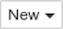
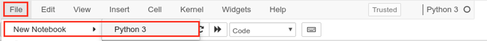
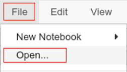
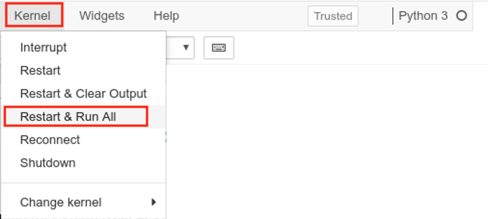

# Embedded Python Execution

Embedded Python Execution, a feature of **Oracle Machine Learning for Python**, gives you the ability to invoke user-defined Python functions in Python engines that run on the Oracle Database server. The Python scripts execute in one or more Python engines that are dynamically started and managed by Oracle Database.

Embedded Python execution includes the ability to create and store user-defined Python functions as scripts in the Oracle Machine Learning for Python script repository. You may create and manage the Python scripts in the Scripts repository using a Python interface and a SQL interface.

## Before You Begin

### Objectives

This lab highlights the embedded python execution feature of Oracle Machine Learning for Python.

- Explore the Python interfaces for Embedded Python Execution
- Utilize the Scripts Repository for storing and retrieving Python scripts from the Oracle Database

### Requirements

To complete this lab, you need the following account credentials and assets:

- Oracle Cloud Infrastructure Console login credentials and tenancy name
- Public IP Address and login credentials of the lab virtual machine (VM) for the hands-on exercises

## **STEP 0** : Create a New Jupyter Notebook

>**Note** : If like to use a prebuilt Jupyter notebook for this lab (so you don't have to copy/paste commands from this manual), proceed directly to the section **"How to run the lab steps using a pre-built Jupyter Notebook?"** in the **Appendix**.

1. In the lab VM, ensure that the notebook server is started and the dashboard is displayed as follows:


2. Create a new Jupyter notebook. Click on the  button at the top right and select the  kernel from the dropdown as shown below.


3. Or, if you are in another notebook, you need to click **File** -> **New Notebook** -> **Python3** as follows:



4. You will be presented a blank notebook.


5. To use **Oracle Machine Learning for Python**, you must first import the ***oml*** Python module which contains the routines of OML4Py.

>**Note** : The ***oml*** module depends on few other Python modules, including ***cx_Oracle***, which is the module that enables Oracle Database access from Python.

6. Copy the below **"import oml"** Python statement by clicking the  button.

````
<copy>import oml</copy>
````

7. Paste the code in a blank cell of the notebook. Note the cell will be in **Edit mode** when the border is green.


8. Run the statement by clicking the  button. This will run the statement in the box where the cursor is currently active.

9. After the statement is run, a new blank cell created and the cell that was run get a number assigned in square brackets, and the green border moves to the next cell.


10. Unless you plan on using the prebuilt Jupyter notebooks, please continue to use the above method of copying/pasting Python commands from the lab manual to the Jupyter notebook session in the lab VM.

## **STEP 1** : Load a Sample Dataset in the Oracle Database

Load a sample dataset that will be used in this lab.

1. First, make a connection to the Oracle Database using ***oml.connect()*** and ensure that ***oml.isconnected()*** returns **True** after a successful connection.

````
<copy>import warnings
warnings.filterwarnings('ignore')

import oml
oml.connect("labuser","labuser", host="localhost", port=1521, service_name="pdb")

oml.isconnected()</copy>
````

2. Load the **iris** dataset from **sklearn.datasets**. Store the dataset in a permament table in the database using ***oml.create()***, and return the OML DataFrame proxy object (**IRIS**) to the Python session.

> **Note** : The predictors and the target variables will be combined in the same table.

````
<copy>from sklearn.datasets import load_iris
from sklearn import linear_model
import pandas as pd

iris = load_iris()
x = pd.DataFrame(iris.data,
                 columns = ["SEPAL_LENGTH", "SEPAL_WIDTH", "PETAL_LENGTH", "PETAL_WIDTH"])
y = pd.DataFrame(list(map(lambda x: {0:'setosa', 1: 'versicolor', 2:'virginica'}[x], iris.target)),
                 columns = ['Species'])
iris_df = pd.concat([x,y], axis=1)

try:
    oml.drop(table="IRIS")
except:
    pass

IRIS = oml.create(iris_df, table="IRIS")
IRIS.head(4)</copy>
````

## **STEP 2** : Build and Score a Linear Model in Python

A best practice with embedded Python execution is to first validate your Python script and the user-defined function before invoking the embedded Python APIs. The next few steps demonstrate this method.

1. Apply a simple Linear Regressor from **sklearn** on the **iris\_df** Pandas DataFrame object. Remember that **iris\_df** was used to create the OML DataFrame (**IRIS**) which resides in the database.

````
<copy>from sklearn import linear_model
lm = linear_model.LinearRegression()
X = iris_df[["PETAL_WIDTH"]]
y = iris_df[["PETAL_LENGTH"]]
mod = lm.fit(X, y)
print("Model:",mod)</copy>
````

2. Predict using the model and print the first 10 predictions.

````
<copy>pred = mod.predict(iris_df[["PETAL_WIDTH"]])
pred[0:10]</copy>
````

3. Compute the model quality using mean squared error and R^2 score.

````
<copy>from sklearn.metrics import mean_squared_error, r2_score

print('Coefficients: \n', mod.coef_)
print("Mean squared error: %.2f" % mean_squared_error(iris_df[["PETAL_LENGTH"]], pred))
print('Variance score (1 is perfect prediction): %.2f' % r2_score(iris_df[["PETAL_LENGTH"]], pred))</copy>
````

4. Generate a scatterplot of the data along with a plot of the regression line. You now have a working ML pipeline that works in your local Python session.

````
<copy>import matplotlib.pyplot as plt

plt.scatter(iris_df.loc[:,"PETAL_WIDTH"], iris_df.loc[:,"PETAL_LENGTH"])
plt.plot(iris_df[["PETAL_WIDTH"]], pred, color='blue', linewidth=3)

plt.xticks(()) # Disable ticks
plt.yticks(())

plt.show()</copy>
````

## **STEP 3** : Use Embedded Python Execution to Build and Score the Previous Model

In embedded Python execution, a script executes in one or more Python engines that run on the database server. The engines are dynamically started and managed by Oracle Database. From the same Python script you can get structured data and PNG images through a BLOB column in a database table.

Using embedded Python execution, let's build the same linear model, but on the database server.

1. First, we'll define our function, **build\_lm\_1**, that returns the linear model as the result. We refer to this as a **user-defined** function. As we did above, we'll go further and score the training data and plot the model against the data points as well.

    We execute this function to ensure it returns what we expect. In this case, both an image and a model.

````
<copy>def build_lm_1(dat):
    import oml
    from sklearn import linear_model
    import matplotlib.pyplot as plt

    lm = linear_model.LinearRegression()
    X = dat[["PETAL_WIDTH"]]
    y = dat[["PETAL_LENGTH"]]
    mod = lm.fit(X, y)

    pred = mod.predict(dat[["PETAL_WIDTH"]])
    plt.scatter(dat.loc[:,"PETAL_WIDTH"], dat.loc[:,"PETAL_LENGTH"])
    plt.plot(dat[["PETAL_WIDTH"]], pred, color='blue', linewidth=3)
    plt.xticks(()) # Disable ticks
    plt.yticks(())
    plt.show()
    return mod</copy>
````

2. So far, the above is a simple Python function that takes in a Python DataFrame as input and fits a linear model using the DataFrame. The function also generates a scatterplot along the regression line after predicting with the linear model.

    Let's test this function using **iris\_df** DataFrame.

````
<copy>build_lm_1(iris_df)</copy>
````

3. Let's use the ***table\_apply()*** function of OML4Py.

    The ***table\_apply()*** function takes the proxy object (e.g. **IRIS**) as input data and passes that data to the user-defined function as a pandas DataFrame. The user-defined function itself is passed as a Python function object to ***table\_apply()***, as follows.

````
<copy>mod = oml.table_apply(data=IRIS, func=build_lm_1)
print("Type:",type(mod))
print("Object:",mod)</copy>
````

4. We see the scatterplot gets displayed and looks similar to the earlier plot when the function was run locally, which means that the embedded python execution was successful.

    The linear model gets returned to the Python session as a proxy OML object (i.e. the model resides in the database and only the proxy object is returned).

    Let's pull the model to the client using the ***pull()*** method. Check the type of the object that was returned using the ***type()*** function, and verify that it is of type **sklearn.linear_model.base.LinearRegression**. You can also print the model metadata and the linear model's coefficient.

````
<copy>mod_local = mod.pull()
print("\nType:",type(mod_local))
print("Model:",mod_local)
print("Coefficient", mod_local.coef_)</copy>
````

5. Next, let's use the ***row\_apply()*** function.

    The ***row\_apply*** function can be used to invoke a user-defined function on chunks of rows, which is useful to perform scoring in parallel for native Python models.

    In this example, the user-defined function ***score\_lm\_1*** takes a pandas DataFrame and a linear model as input. The ***row\_apply*** invocation takes the following arguments: The proxy object IRIS, the number of rows scored at a time (10 rows which resulting in 15 function invocations), the user-defined functions, the linear model object, and that we want the result to be returned as a single table (a Pandas DataFrame).

````
<copy>def score_lm_1(dat, model):
    import pandas as pd
    from sklearn import linear_model
    pred = model.predict(dat[["PETAL_WIDTH"]])
    return pd.concat([dat[['Species', 'PETAL_LENGTH']],
                      pd.DataFrame(pred, columns=['PRED_PETAL_LENGTH'])], axis=1)

res = oml.row_apply(IRIS, rows=10, func=score_lm_1, model=mod_local,
                    func_value=pd.DataFrame([('a', 1, 1)],
                                            columns=['Species', 'PETAL_LENGTH', 'PRED_PETAL_LENGTH']))
res.head()</copy>
````

6. Lastly, let's use the ***group\_apply()*** function.

    The ***oml.group_apply()*** method groups the values in a database table by one or more columns and then executes a user-defined Python function on each group.

    Only for illustrative purposes, let's use the ***group\_apply()*** function to partition the data according to one or more columns and score, just as in the previous step.

````
<copy>res = oml.group_apply(IRIS, index=IRIS[['Species']], func=score_lm_1, model=mod_local,
                    func_value=pd.DataFrame([('a', 1, 1)],
                                            columns=['Species', 'PETAL_LENGTH', 'PRED_PETAL_LENGTH']))

res.head()</copy>
````

## **STEP 4** : Using the Python Script Repository

The Oracle Machine Learning for Python script repository stores user-defined Python functions as scripts for use with embedded Python execution functions. The script repository is a component of the embedded Python execution functionality.

From the script repository, you may grant or revoke the read privilege to a script, list the available scripts, load a script function into the Python environment, or drop a script from the script repository.

### 4.1. Create and Store Scripts

Use the ***oml.script.create()*** function to add a Python function as a script in the script repository. The function allows you to store a script that contains a single Python function definition in the Oracle Machine Learning for Python script repository.

1. Define a Python function and create a script in the repository by the name **MYLM**.

````
<copy># Define a function.
def build_lm1(dat):
    from sklearn import linear_model
    regr = linear_model.LinearRegression()
    import pandas as pd
    dat = pd.get_dummies(dat, drop_first=True)
    X = dat[["Sepal_Width", "Petal_Length", "Petal_Width", "Species_versicolor", "Species_virginica"]]
    y = dat[["Sepal_Length"]]
    regr.fit(X, y)
    return regr

# Create a private script.
oml.script.create("MYLM", func=build_lm1)</copy>
````

2. Define another function and this time create a global script which is available to any user, using ***is_global=True***.

````
<copy># Define another function.
def build_lm2(dat):
    from sklearn import linear_model
    regr = linear_model.LinearRegression()
    X = dat[["Petal_Width"]]
    y = dat[["Petal_Length"]]
    regr.fit(X, y)
    return regr

# Create a global script, available to any user.
oml.script.create("GLBLM", func=build_lm2, is_global=True)</copy>
````

3. Define the same function but specified as a string. Also, overwrite the previous **GLBM** script in the repository using ***overwrite=True***.

````
<copy># Define the same function, specified as a string.
func_str = '''def build_lm2(dat):
    from sklearn import linear_model
    regr = linear_model.LinearRegression
    X = dat[["Petal_Width"]]
    y = dat[["Petal_Length"]]
    regr.fit(X, y)
    return regr
'''

# Overwrite the previous GLBLM script in the script repository.
oml.script.create("GLBLM", func=build_lm2, is_global=True, overwrite=True)</copy>
````

### 4.2. List Available Scripts

Use the ***oml.script.dir()*** function to list the scripts in the Oracle Machine Learning for Python script repository.

1. List the scripts in the script repository available to the current user only.

````
<copy>oml.script.dir()</copy>
````

2. List all the scripts available to the current user, even owned by other users.

````
<copy>oml.script.dir(sctype='all')</copy>
````

3. List the scripts available to all users.

````
<copy>oml.script.dir(sctype='global')</copy>
````

4. List the scripts that contain the letters **BL** and that are available to all users.

````
<copy>oml.script.dir(name="BL", regex_match=True, sctype='all')</copy>
````

### 4.3. Load and Remove Scripts

1. Use the ***oml.script.load()*** function to load a Python script from the script repository into a Python session.

````
<copy>MYLM = oml.script.load(name="MYLM")
GMYLM = oml.script.load(name="GLBLM")</copy>
````

2. Print the script source from the repository.

````
<copy>print(MYLM.get_source())</copy>
````

````
<copy>print(GMYLM.get_source())</copy>
````

3. Use the ***oml.script.drop()*** function to remove a script from the script repository. The below example drops scripts the **MYLM** private script and the **GLBLM** global script from the script repository.

````
<copy># List the available scripts.
oml.script.dir(sctype="all")

# Drop the private script.
oml.script.drop("MYLM")

# Drop the global script.
oml.script.drop("GLBLM", is_global=True)

# List the available scripts again.
oml.script.dir(sctype="all")</copy>
````

## **STEP 5** : Build a Model Per Species Using Group Apply

A better use of ***group\_apply()*** - which is the ability to automatically split the table data based on values in one or more columns - is for model building (vs. model scoring as we have seen earlier).

The ***group\_apply()*** function passes the oml.DataFrame specified by the data argument to the user-defined function as its first argument. The user-defined function is then invoked on each group.

The ***index*** argument specifies the columns of the oml.DataFrame by which Oracle Database groups the data for processing by the user-defined Python function. The oml.group_apply function can use data-parallel execution, in which one or more Python engines perform the same Python function on different groups of data using the ***parallel*** argument.

In this step, we build three models, one specific to each species, and return them as a dictionary.

1. Use the previous Python function you've defined for building the model (**build\_lm\_1**) and call using ***group\_apply()***.

````
<copy>mod = oml.group_apply(IRIS[:,["PETAL_LENGTH","PETAL_WIDTH","Species"]],
                      index=oml.DataFrame(IRIS['Species']),
                      func=build_lm_1, parallel=2)

print("Type:",type(mod))
mod_local = mod.pull()
print("Type:",type(mod_local))
mod_local</copy>
````

2. Next, change the user-defined function to save each model in a datastore - instead of returning it - and return ***True*** instead. The datastore allows storing Python objects in the database under the provided name. The object assumes the name it is assigned in Python, here "**mod\_**" and the corresponding **Species** value.

````
<copy>def build_lm_2(dat, dsname):
    import oml
    from sklearn import linear_model
    lm = linear_model.LinearRegression()
    X = dat[["PETAL_WIDTH"]]
    y = dat[["PETAL_LENGTH"]]
    lm.fit(X, y)
    name = "mod_" + dat.loc[dat.index[0],'Species']
    oml.ds.save(objs = {name: lm}, name=dsname,
                append=True)
    return name</copy>
````

3. Let's run ***group\_apply()***. But first, if the datastore exists, we delete it so that the ***group\_apply*** function completes successfully.

    Notice the use of ***oml\_connect = True***. This controls whether to automatically connect to a Python session from inside the embedded Python execution function. If you specify oml\_connect=TRUE, then the connection is made with the same credentials as the client session. For security, you should use this argument instead of invoking the ***oml.connect()*** function within the user-defined Python function itself. The default value is **False**. Connecting to the database is necessary when using the datastore functionality.

    We then print the outcome, which contains a dictionary of three elements each assigned the model object name.

````
<copy>try:
    oml.ds.delete('ds-1')
except:
    print("Datastore not found")
res = oml.group_apply(IRIS[:,["PETAL_LENGTH","PETAL_WIDTH","Species"]],
                      index=oml.DataFrame(IRIS['Species']),
                      func=build_lm_2, dsname="ds-1",
                      oml_connect = True)
print("Outcome:",res)</copy>
````

4. When we load the datastore, we get the three models loaded into the client Python engine, assigned to their respective variables. We can view the model for **versicolor**.

````
<copy>print("Datastore objects:",oml.ds.load("ds-1"))
print("Versicolor model:",mod_versicolor)</copy>
````

## **STEP 6** : Using Third-Party Python Packages in Embedded Execution

Embedded Python execution can also leverage functions from third-party packages. These packages need to be installed on the database server machine, but can then be used inside the user-defined function as shown here using LinearSVC.

1. Create the below script in the Python script repository that uses **sklearn.svm**.

````
<copy>def fit(data):
    import matplotlib.pyplot as plt

    from sklearn.svm import LinearSVC
    x = data.drop('Species', axis = 1).values
    y = data['Species']
    mod =  LinearSVC().fit(x, y)
    return mod

oml.script.create("sk_svc_fit", fit, overwrite = True)
oml.script.dir()</copy>
````

2. Invoke the Python function using ***table\_apply()***. Then pull the model to the client and view its type, which is of type **sklearn.svm.classes.LinearSVC**.

````
<copy>mod = oml.table_apply(data=IRIS,
                      func = 'sk_svc_fit',
                      oml_input_type="pandas.DataFrame")
print("Type:",type(mod))
mod_local = mod.pull()
print(type(mod_local))
print('Coefficients: \n', mod_local.coef_)</copy>
````

3. The model can now be used normally, e.g., to predict outcomes as follows.

````
<copy>pred = mod_local.predict(iris_df.drop('Species', axis = 1).values)
pred2 = pred.reshape((-1,1))
pred2[0:10]</copy>
````

4. Let's assess model quality using a confusion matrix computed from the sklearn.metrics function ***confusion\_matrix()***.

````
<copy>from sklearn.metrics import confusion_matrix

conf_mat = confusion_matrix(iris_df[["Species"]], pred2)
conf_mat</copy>
````

5. The ***group\_apply()*** function can also be used for simple or complex computations. For example, here it is used to simply count the number of each species in the data set.

````
<copy>def group_count(dat):
  import pandas as pd
  return pd.DataFrame([(dat["Species"][0], dat.shape[0])],
                      columns = ["Species", "CNT"])

index = oml.DataFrame(IRIS['Species'])
res = oml.group_apply(IRIS, index, func=group_count,
                      oml_input_type="pandas.DataFrame",
                      func_value=pd.DataFrame([('a', 1)],
                                              columns=["Species", "CNT"]))
res</copy>
````

6. The ***index\_apply()*** function allows the same function to invoked a specified number of times. The first argument to the user-defined function is an index number for the function execution. For example, if the **times** argument is 12, each function invocation will receive a distinct value between 1 and 10.

    This can be used, e.g., for selecting behavior within the function or setting a random seed for Monte Carlo analysis.

````
<copy>def compute_random_mean(index):
    import numpy as np
    import scipy
    from statistics import mean
    np.random.seed(index)
    res = np.random.random((100,1))*10
    return mean(res[1])

print("Test: ", compute_random_mean(3))

res = oml.index_apply(times=12, func=compute_random_mean)
res.pull()</copy>
````

## **STEP 7** : Returning Multiple Images from Embedded Python Execution

1. Here, we create a function ***RandomRedDots()*** that creates a simple DataFrame and generates two plots of random red dots. We create a function in the Python Script Repository also named ***RandomRedDots()***, and then execute the native Python function.

````
<copy>def RandomRedDots ():
    import numpy as np
    import pandas as pd
    import matplotlib.pyplot as plt

    d = {'id': range(1,10), 'val': [x/100 for x in range(1,10)]}
    df = pd.DataFrame(data=d)
    plt.scatter(range(0,100), np.random.rand(100),c='r')
    plt.title("Random Red Dots")
    plt.show()
    plt.scatter(range(0,10), np.random.rand(10),c='r')
    plt.title("Random Red Dots")
    plt.show()
    return df

oml.script.create("RandomRedDots", func=RandomRedDots, is_global=True, overwrite=True)

RandomRedDots()</copy>
````

2. If we simply invoke the named function, we see that the result is an OML object. Notice that we see only a single image. To ensure we get both plots, we can modify the function in one of two ways as shown next.

````
<copy>res = oml.do_eval(func="RandomRedDots")
print("Type: ", type(res))

res</copy>
````

3. Here, we create separate figure objects, add subplots, and then create the scatter plot. We'll store this in the script repository as **RandomRedDots2** and invoke the function to see the results.

````
<copy>def RandomRedDots2 ():
    import numpy as np
    import pandas as pd
    import matplotlib.pyplot as plt  

    d = {'id': range(1,10), 'val': [x/100 for x in range(1,10)]}
    df = pd.DataFrame(data=d)
    fig = plt.figure(1)
    ax = fig.add_subplot(111)
    ax.scatter(range(0,100), np.random.rand(100),c='r')
    fig.suptitle("Random Red Dots")

    fig2 = plt.figure(2)
    ax2 = fig2.add_subplot(111)
    ax2.scatter(range(0,10), np.random.rand(10),c='r')
    fig2.suptitle("Random Red Dots")
    return df

oml.script.create("RandomRedDots2", func=RandomRedDots2, is_global=True, overwrite=True)

RandomRedDots2()</copy>
````

4. Invoke ***RandomRedDots2()*** using embedded Python execution, we get both plots shown in the result.

````
<copy>res = oml.do_eval(func="RandomRedDots2")
type(res)

res</copy>
````

5. Another way to approach this is to create a single plot composed to two subplots. This approach is somewhat simpler, but yields only a single image. Generating two images may be desired when using the SQL API so that each image is returned as a separate row. See the SQL API demo script for an example.

````
<copy>def RandomRedDots3 ():
    import numpy as np
    import pandas as pd
    import matplotlib.pyplot as plt
    import oml  

    d = {'id': range(1,10), 'val': [x/100 for x in range(1,10)]}
    df = pd.DataFrame(data=d)

    plt.subplot(2,1, 1)
    plt.scatter(range(0,100), np.random.rand(100),c='r')
    plt.title("Random Red Dots")

    plt.subplot(2, 1, 2)
    plt.scatter(range(0,10), np.random.rand(10),c='r')
    plt.title("Random Red Dots")
    return df

oml.script.create("RandomRedDots3", func=RandomRedDots3, is_global=True, overwrite=True)
oml.do_eval(func="RandomRedDots3", oml_connect = True)</copy>
````

6. We can also return only the structured contents as an OML DataFrame, which keeps the result in the database - returning a proxy object to the result. We pull the results to the notebook explicitly to display it locally.

````
<copy>import pandas as pd
res = oml.do_eval(func=RandomRedDots, func_value=pd.DataFrame({"id":[0],"val":[0]}))
type(res)

res.pull()</copy>
````

## Summary

Using the Embedded Python Execution feature of OML4Py you can utilize the processing power of the Database server for running your ML tasks. You can also use third-party Python packages for and execute various third-party algorithms that are currently not supported within the Oracle Database. You have also seen the benefits of storing the Python scripts in the database.

## Appendix

### How to run this lab using a pre-built Jupyter Notebook?

Follow the below steps if you are short on time and choose to run the labs without copying/pasting the commands from this manual.

1. In the lab VM, ensure that the notebook server is started and the dashboard is displayed as follows:


2. Click on **saved_notebooks** to browse the folder that contains the saved Python notebooks.


> If you are in another notebook, or cannot locate the notebook dashboard, click **File** -> **Open**.
>
>

3. In the **saved-notebooks** folder click on **4-embedded-python-exec** lab.

4. You will be presented the notebook for this lab. Run the entire notebook by clicking **Kernel** -> **Restart and Run All**. This will run all executable statements of the notebook (i.e. in the Python statements in the cells).



5. Confirm that you like to **Restart and Run All Cells**. The notebook will take a few minutes to run.


6. After all cells of the notebook successfully complete, you will see that each cell will get a number assigned in square brackets and (optionally) an output will be shown (also ensure there were no errors).

7. You have successfully executed the notebook. You may now go through the notebook steps and inspect the individual commands and their respective outputs.
