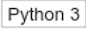
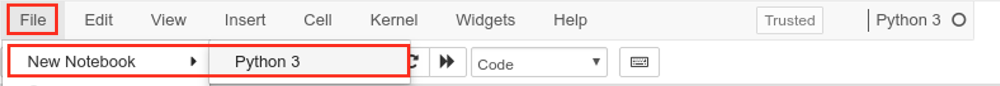
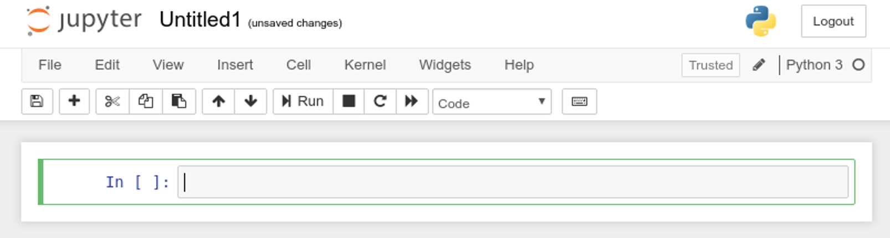
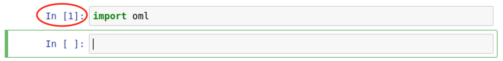
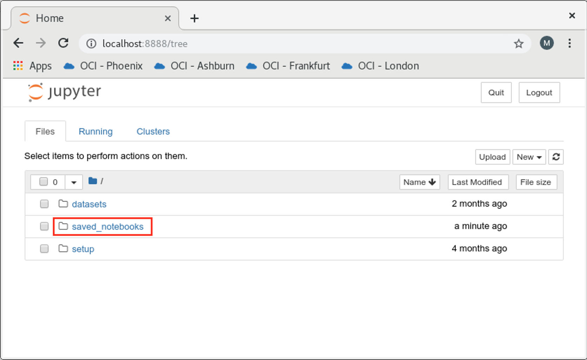
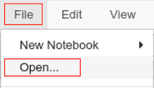
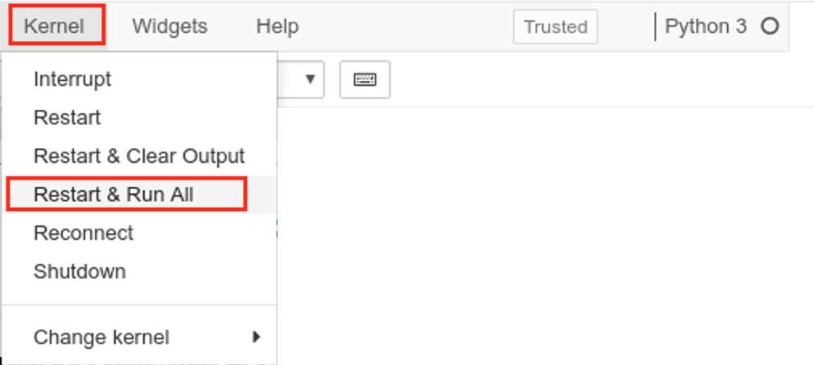

# Getting Started with Oracle Machine Learning for Python

**Oracle Machine Learning for Python (OML4Py)** is a component of the Oracle Database Enterprise Edition that makes open source Python ready for the enterprise and big data. OML4Py integrates Python with the Oracle Database and provides a comprehensive, database-centric environment for end-to-end analytical processing.

OML4Py provides the users the capability to execute Python functions on database-resident data for data exploration and preparation, whilst seamlessly leveraging the Oracle Database as a high-performance computing (HPC) environment. Furthermore, Python users can natively invoke powerful in-database machine learning algorithms directly in Python.

OML4Py also provides the ability to immediately deploy the machine learning scripts to production environments, and assist with operationalizing the Python scripts for analytical applications.

Oracle Machine Learning for Python also introduces new capabilities for automated model selection, automated feature selection, and auto tuning of algorithm hyperparameters – thereby helping automate and simplifying key data science tasks and minimize manual efforts.

### Key Benefits of Oracle Machine Learning for Python

- Seamlessly leverage Oracle Database as an HPC environment for Python scripts – whilst providing data parallelism and resource management
- Provide wide range of in-database predictive analytics and machines learning algorithms
- Avoid reinventing code to integrate Python results into existing applications
- Operationalize entire Python scripts in production applications - eliminate porting Python code
- Minimize data movement from enterprise data stores and Python clients
- Perform scalable exploratory data analysis for big data
- Use Python packages contributed by the Python community
- Automatically leverage database backup and recovery mechanisms
- Reach Hadoop data through Oracle Big Data SQL

## Before You Begin

### Objectives

This lab highlights the following features of OML4Py :

- Connect to an Oracle Database from a Python session
- Move data between Oracle Database and Python
- Use Datastores to store Python objects

### Requirements

To complete this lab, you need the following account credentials and assets:

- Oracle Cloud Infrastructure Console login credentials and tenancy name
- Public IP Address and login credentials of the lab virtual machine (VM) for the hands-on exercises

## **STEP 0** : Create a New Jupyter Notebook

>**Note** : If like to use a prebuilt Jupyter notebook for this lab (so you don't have to copy/paste commands from this manual), proceed directly to the section **How to run the lab steps using a pre-built Jupyter Notebook?** in the **Appendix**.

1. In the lab VM, ensure that the notebook server is started and the dashboard is displayed as follows:


2. Create a new Jupyter notebook. Click on the  button at the top right and select the  kernel from the dropdown as shown below.


3. Or, if you are in another notebook, you need to click **File** -> **New Notebook** -> **Python3** as follows:



4. You will be presented a blank notebook.



5. To use **Oracle Machine Learning for Python**, you must first import the ***oml*** Python module which contains the routines of OML4Py.

>**Note** : The ***oml*** module depends on few other Python modules, including ***cx_Oracle***, which is the module that enables Oracle Database access from Python.

6. Copy the below **"import oml"** Python statement by clicking the  button.

````
<copy>import oml</copy>
````

7. Paste the code in a blank cell of the notebook. Note the cell will be in **Edit mode** when the border is green.


8. Run the statement by clicking the  button. This will run the statement in the box where the cursor is currently active.

9. After the statement is run, a new blank cell created and the cell that was run get a number assigned in square brackets, and the green border moves to the next cell.



10. Unless you plan on using the prebuilt Jupyter notebooks, please continue to use the above method of copying/pasting Python commands from the lab manual to the Jupyter notebook session in the lab VM.

## **STEP 1** : Connect to the Oracle Database

OML4Py allows you to connect to the Oracle Database from a Python session. The connection not only makes the database resident data accessible in Python, but also the processing power, memory, and storage capacities of the database server.

**Note** : OML4Py supports a variety of connection options for connecting to the Oracle Database, including Oracle Wallets which is the preferred method of connection to the Oracle Autonomous Database.

1. Create a connection to the Oracle Database server using ***oml.connect()***. This method establishes a connection to a user schema in the Oracle Database instance.

    **Note** : The Oracle Database needs the appropriate OML4Py server components pre-installed for a successful connection.

````
<copy>oml.connect("labuser","labuser", host="localhost", port=1521, service_name="pdb")</copy>
````

2. Once connected, invoke ***oml.isconnected()*** to check if the connection was successful. The function will return **True** if the connection was successful.

````
<copy>oml.isconnected()</copy>
````

3. Users can get online help using Python's ***help()*** function and specifying the function of interest. For example:

````
<copy>help(oml.connect)</copy>
````

## **STEP 2** : Move Data between a Database and a Python Session

One of the benefits of OML4Py is its capability to interact with the data structures in an Oracle Database schema from a Python session. OML4Py allows you to move data between a Python session and the Oracle database, and persist it as a temporary database table or a permanent table.

### 2.1. Create a Temporary Database Table using a Python Dataset

1. You can create a temporary table in the Oracle database and store the Python resident data in the table using ***oml.push()***. The push function inserts data into the temporary table and returns a corresponding **OML DataFrame** (oml.DataFrame) object that references the database table from the client Python engine.

  The temporary table exists as long as the oml object that references it exists, either in the Python engine memory or in the OML4Py **datastore**. The temporary table is automatically deleted when the Python session disconnects, unless you saved the object to a datastore before disconnecting (**datastores** are discussed later in this lab).

  The example below creates a Pandas DataFrame object (**pd\_df**) with columns of various data types. It pushes the dataframe **pd\_df** to a temporary database table in the Oracle database, which creates the OML Dataframe (**oml_df**) object that references the temporary table.

````
<copy>import pandas as pd

# Create a Pandas DataFrame

pd_df = pd.DataFrame({'numeric': [1, 1.4, -4, 3.145, 5, None],
                      'string' : [None, None, 'a', 'a', 'a', 'b'],
                      'bytes' : [b'a', b'b', b'c', b'c', b'd', b'e']})

# Push the Pandas DataFrame to a database table with the specified dbtypes for each column

oml_df = oml.push(pd_df, dbtypes = {'numeric': 'BINARY_DOUBLE',
                                    'string': 'CHAR(1)',
                                    'bytes': 'RAW(1)'})</copy>
````

2. Note the ***dbtypes*** argument of ***oml.push()*** lets you specify the SQL data types for the table columns. The values of dbtypes may either be:

    - A **dict** that maps a key (column name) to its value, for example: {'numeric' : 'BINARY_DOUBLE'}
    - A **list** of values, example: {'BINARY_DOUBLE', 'VARCHAR2'}

3. Get the column names of the OML DataFrame object using the ***columns()*** method. In OML4Py, the columns method is overloaded to work with Oracle database tables and returns column names of the Oracle table.

    **Note** : OML4Py overloads quite a few Python functions to work with Oracle database-resident objects.

````
# Get the column names of the temporary table
<copy>oml_df.columns</copy>
````

4. Sample the first few rows from the temporary table using the ***head()*** method. Just like the columns method, ***head()*** is also overloaded to work with Oracle database tables and it returns the first few rows from the table.

````
# Sample the first few rows
<copy>oml_df.head()</copy>
````

### 2.2. Create a Persistent Database Table from a Python Dataset

OML4Py also allows you to persist the Python data as a permanent database table in the Oracle database that gets saved even after the Python session disconnects.

1. Use the ***oml.create()*** function to create a persistent table in the database schema from data in the Python session. ***oml.create()*** creates the table and returns an **OML DataFrame** object that is a proxy for the table. This is similar to ***oml.push()*** except that the table created in Oracle is a permanent table.

````
<copy>df = pd.DataFrame({'numeric': [1, 1.4, -4, 3.145, 5, 2],
                   'string' : [None, None, 'a', 'a', 'a', 'b'],
                   'bytes' : [b'a', b'b', b'c', b'c', b'd', b'e']})

# Create a table with the default parameters

try: oml.drop(table="tbl1")
except: pass

oml_df1 = oml.create(df, table = 'tbl1')</copy>
````

2. Get the column names of the permanent table that was just created using the ***columns()*** method.

````
# Get the columns names
<copy>oml_df1.columns</copy>
````

3. Sample the first few rows using ***head()***.

````
<copy>oml_df1.head()</copy>
````

4. Notice that ***dbtypes*** argument was not used when creating the permanent table. In this case, OML4Py determines the default column types by randomly sampling 20 rows from the table (or the full table if the table has less than 20 rows).

5. Display the default data types of the table that was just created using an ***oml.cursor()*** object. oml.cursor opens a SQL cursor in the Oracle database which can be executed using the ***execute()*** method and the query results fetched using the ***fetchall()*** method.

````
<copy># Create a cursor object for the current oml database connection
# to execute queries and get information from the database

cr = oml.cursor()

# Show the default SQL data types of the columns

_ = cr.execute("select data_type from all_tab_columns where table_name = 'tbl1'")
cr.fetchall()</copy>
````

6. If the data in a Pandas DataFrame column contains **NaN** values, then you should use ***oranumber=False*** clause. Doing so will change the table's data type to BINARY_DOUBLE from NUMBER.

    **Note** : Oracle's BINARY_DOUBLE allows a double-precision native floating point number that supports **+Inf**, **-Inf**, and **NaN** values.

````
<copy># Create a table with oranumber set to False

try: oml.drop(table="tbl2")
except: pass

oml_df2 = oml.create(df, table = 'tbl2', oranumber = False)

# Show the SQL data typea of the columns
_ = cr.execute("select data_type from all_tab_columns where table_name = 'tbl2'")
cr.fetchall()</copy>
````

7. If the values in a column are all **None**, or if a column has inconsistent data types in the sampled rows, then a default column type cannot be determined. In such case the column type can be specified using the ***dbtypes*** argument. Using dbtypes you can specify the SQL data types for the table columns.

    Create a table with ***dbtypes*** specified as a **dict** mapping column names to SQL data types.

````
<copy># Create a table with dbtypes specified as a dict mapping column names to SQL data types

try: oml.drop(table="tbl3")
except: pass

oml_df3 = oml.create(df, table = 'tbl3', dbtypes = {'numeric': 'BINARY_DOUBLE', 'bytes':'RAW(1)'})

# Show the SQL data types of the columns

_ = cr.execute("select data_type from all_tab_columns where table_name = 'tbl3'")
cr.fetchall()</copy>
````

8. Next, you will create another permanent table but this time with dbtypes specified as a list of SQL data types that matches the order of the columns.

````
<copy># Create a table with dbtypes specified as a list of SQL data types
# matching the order of the columns

try: oml.drop(table="tbl4")
except: pass

oml_df4 = oml.create(df, table = 'tbl4', dbtypes = ['BINARY_DOUBLE','CHAR(1)','RAW(1)'])

# Show the SQL data type of the columns

_ = cr.execute("select data_type from all_tab_columns where table_name = 'tbl4'")
cr.fetchall()</copy>
````

9. Finally, you may delete the persistent table in an Oracle Database schema with the ***oml.drop()*** function.

    **Caution:**
    The ***oml.drop()*** function deletes a persistent database table and is an irreversible operation. Also, the Python ***del*** function will remove an oml.DataFrame proxy object (Proxy objects are discussed shortly) and its associated temporary table; ***del*** does not delete a persistent table.

````
<copy># Drop the persistent tables
oml.drop('tbl1')
oml.drop('tbl2')
oml.drop('tbl3')
oml.drop('tbl4')</copy>
````

### 2.3. Pull Data from the Database to a Local Python Session

1. OMl4Py allows you to pull (copy) data from the database into a Python session. Use the ***pull()*** method of the oml proxy object to create a local Python object that contains a copy of the data referenced by the oml object. The pull method of an oml object returns a Python object of the same type. The Python object exists in-memory in the local Python session.

    The example below displays the type of the **oml\_df** object that references the temporary database table created earlier. Notice that **oml\_df** is an OML DataFrame object.

````
# Display the data type of oml_df
<copy>type(oml_df)</copy>
````

2. Pull the data from **oml\_df** object (database-resident) to **df2** object in local memory using ***pull()***.

````
# Pull the data from oml_df into local memory
<copy>df2 = oml_df.pull()</copy>
````

3. Display the type of **df2**. Notice that df2 is a Pandas DataFrame object. Whenever you pull data from the database (OML DataFrame object), the result will be stored locally in Python as a Pandas DataFrame.

````
# Display the data type of df
<copy>type(df2)</copy>
````

**Note** : You can pull data to a local Pandas DataFrame only if the data can fit into the Python session memory.

### 2.4. Create a Python Proxy Object for a Database Object

Proxy objects are references to the actual objects that reside in the database. They only exist in the current session and will be deleted when the database connection is terminated, unless they are stored in a datastore.

1. To demonstrate this example let's first load a dataset into the Database. We will load the **IRIS** dataset into the Python session and then push it to the Database using ***oml.create()***.

````
<copy>from sklearn.datasets import load_iris
import pandas as pd

# Load the IRIS dataset from sklearn.datasets

iris = load_iris()

# Extract the relevant vectors from the dataset

x = pd.DataFrame(iris.data,
                 columns = ["SEPAL_LENGTH", "SEPAL_WIDTH", "PETAL_LENGTH", "PETAL_WIDTH"])
y = pd.DataFrame(list(map(lambda x: {0:'setosa', 1: 'versicolor', 2:'virginica'}[x], iris.target)),
                 columns = ['Species'])

# Create the Pandas DataFrame of the IRIS dataset

iris_df = pd.concat([x,y], axis=1)

# Load the IRIS dataset into a Database table named IRIS

try:
    oml.drop(table="IRIS")
except:
    pass
IRIS = oml.create(iris_df, table="IRIS")</copy>
````

2. Print the first few lines from the loaded dataset to ensure the table IRIS was successfully loaded in the Database.

````
<copy>IRIS.head(4)</copy>
````

3. Now that we have a sample dataset loaded in the database, use the ***oml.sync()*** function to create a Python object as a proxy for the IRIS table. The ***oml.sync()*** method pulls the results of a database table, view, or SQL statement, and returns the dataset into an oml.DataFrame object, which becomes the proxy for the database object.

    You can use the proxy oml.DataFrame object to select data from the table. When you execute a Python operation that selects data from the table, the operation returns the current data from the database object.

````
<copy># Create the Python object oml_iris as a proxy for the database table IRIS

oml_iris = oml.sync(table = 'IRIS')
type(oml_iris)

# Get the first few rows from the database

oml_iris.head()</copy>
````

4. If some application adds a column to the IRIS table, or changes any other metadata, the oml.DataFrame proxy object (**oml\_iris**) will not reflect the change until ***oml.sync()*** is invoked again.

    Let's add a new column to the IRIS database table named **GENOME** and note that the **oml\_iris** proxy object does not know about the newly added column.

````
<copy>cr = oml.cursor()

try:
    cr.execute("ALTER TABLE iris ADD (genome VARCHAR2(100))")
except:
    pass

cr.close()</copy>
````

````
<copy>oml_iris.columns</copy>
````

5. Invoke ***oml.sync()*** again to synchronize the metadata of the oml.DataFrame **oml_iris** with the IRIS database table.

````
<copy>oml_iris =  oml.sync(table = "IRIS")
oml_iris.columns</copy>
````

6. To display all oml.DataFrame proxy objects defined in your Python session, use the ***oml.dir()*** function.

````
# List the proxy objects in the schema.
<copy>oml.dir()</copy>
````

## **STEP 3** : Saving Python Objects in the Database

Python objects exist for the duration of the current Python session unless you explicitly save them. You can save one or more Python objects, including OML proxy objects, to a named **Datastore** and then load those objects later in another Python session.

Datastores exist in the user’s Oracle Database schema, and the objects saved to the datastore persist in the database until explicitly deleted. Additionally, the objects in the datastore can be made available to other users or programs by granting them read privileges.

The saved objects in the datastore are made accessible to Embedded Python Execution through the Python and SQL interfaces. Embedded execution is discussed in a different lab.

### 3.1. Save Python Objects to Datastore

Oracle Machine Learning for Python creates the datastore in the user’s Oracle Database schema. A datastore and the objects it contains, persist in the database until you delete them.

1. To demonstrate this feature you will load three data sets. For each dataset, combine the target variable and predictors into a single Pandas DataFrame and invoke ***oml.create()*** to save the dataset in the database, and then display the columns for each using the ***columns*** method.

2. The first dataset you will load is the **iris** dataset from **sklearn.datasets**. First, load the dataset in your Python session as a **Pandas DataFrame** object, and then persist it in the database as a permanent table using ***oml.create()*** which will be referenced in the python session as an **OML DataFrame**.

````
<copy>from sklearn import datasets
from sklearn import linear_model
import pandas as pd

iris = datasets.load_iris()
x = pd.DataFrame(iris.data, columns = ['SEPAL_LENGTH','SEPAL_WIDTH',
                                       'PETAL_LENGTH','PETAL_WIDTH'])
y = pd.DataFrame(list(map(lambda x: {0: 'setosa', 1: 'versicolor',
                 2:'virginica'}[x], iris.target)), columns = ['Species'])
try:
    oml.drop(table='IRIS')
except:
    pass

IRIS = oml.create(pd.concat([x, y], axis=1), table = 'IRIS')
iris = pd.concat([x, y], axis=1)
print(IRIS.columns)</copy>
````

3. Load the second dataset - the **diabetes** dataset. But this time, persist it in the database as a temporary table using ***oml.push()***. Print the OML DataFrame columns once the dataset gets saved in the database.

````
<copy>diabetes = datasets.load_diabetes()

x = pd.DataFrame(diabetes.data, columns=diabetes.feature_names)
y = pd.DataFrame(diabetes.target, columns=['disease_progression'])

DIABETES_TMP = oml.push(pd.concat([x, y], axis=1))
print(DIABETES_TMP.columns)</copy>
````

4. Lastly, load the third dataset - the **Boston housing** dataset, also using ***oml.push()***.

````
<copy>boston = datasets.load_boston()

x = pd.DataFrame(boston.data, columns = boston.feature_names.tolist())
y = pd.DataFrame(boston.target, columns = ['Value'])

BOSTON_TMP = oml.push(pd.concat([x, y], axis=1))
print(BOSTON_TMP.columns)</copy>
````

5. Save the **iris** Pandas DataFrame and the temporary **BOSTON\_TMP** proxy object to a datastore named **ds_pydata** using ***oml.ds.save()***, overwriting if the named datastore already exists with ***overwrite=True*** clause.

    Note that you can store actual data objects in a datastore, but data objects that are large should preferably remain as database tables, for performance and scalability.

    By storing the BOSTON_TMP object, the temporary table will not be deleted when the session terminates.

````
<copy>oml.ds.save(objs={'iris':iris, 'oml_boston':BOSTON_TMP},
            name="ds_pydata", description = "python datasets", overwrite=True)</copy>
````

6. Add a third object, the temporary DIABETES proxy object, to the same datastore using the clause ***append=True***.

````
<copy>oml.ds.save(objs={'oml_diabetes':DIABETES_TMP}, name="ds_pydata", append=True)</copy>
````

7. Save the **IRIS** OML DataFrame to a new datastore named **ds_iris_data**.

````
<copy>oml.ds.save(objs={'iris':IRIS},
            name="ds_iris_data", description = "iris dataset", overwrite=True)</copy>
````

8. List the datastores that you have created using ***oml.ds.dir()***. Notice we see the datastore name, the number of objects in the datastore, the size in bytes consumed, when the datastore was create/updated, and any description provided by the user. Our two datastores **ds_iris_data** and **ds_pydata** are present, with the latter containing three objects.

````
<copy>oml.ds.dir()</copy>
````

9. To illustrate storing other types of objects in datastores, we'll create regression models using sklearn and OML4Py.

````
<copy>regr1 = linear_model.LinearRegression()
regr1.fit(boston.data, boston.target)

regr2 = oml.glm("regression")
X = BOSTON_TMP.drop('Value')
y = BOSTON_TMP['Value']
regr2 = regr2.fit(X, y)</copy>
````

10. Save objects to a datastore and allow the read privilege to be granted to them using ***grantable=True***.

````
<copy>oml.ds.save(objs={'regr1':regr1, 'regr2':regr2},
            name="ds_pymodel", grantable=True, overwrite=True)

oml.ds.dir()</copy>
````

### 3.2. Load Python Objects from Datastore

1. Prior to loading objects from the datastore, let's first remove the exiting Python objects that were stored in the datastore in the previous step.

````
<copy>try: del(iris)
except: pass

try: del(oml_boston)
except: pass

try: del(oml_diabetes)
except: pass</copy>
````

2. Load the all Python objects from the **ds_pydata** datastore to the global workspace and sort the result by name. Notice that they have the name specified in the dictionary when saved, not the Python variable name.

````
<copy>sorted(oml.ds.load(name="ds_pydata"))</copy>
````

3. Verify the objects got loaded using the ***head()*** function.

````
<copy>iris.head()
oml_boston.head()
oml_diabetes.head()</copy>
````

4. Next, selectively load only one object (**regr2**) from **ds\_pymodel** datastore to the global workspace.

````
<copy>oml.ds.load(name="ds_pymodel", objs=["regr2"])</copy>
````

5. Load the named Python object **regr1** from **ds\_pymodel** datastore to the user's workspace.

````
<copy>oml.ds.load(name="ds_pymodel", objs=["regr1"], to_globals=False)</copy>
````

### 3.3. Manage Datastore Objects

Oracle Machine Learning for Python provides functions for managing objects in a datastore.

1. Show all saved datastores using ***oml.ds.dir()***. Notice that you can list the attributes to be printed, as shown in the square brackets.

````
<copy>oml.ds.dir(dstype="all")[['owner', 'datastore_name', 'object_count']]</copy>
````

2. Grant the read privilege on **ds\_pymodel** to all users by specifying ***user=None***.

````
<copy>oml.grant(name="ds_pymodel", typ="datastore", user=None)</copy>
````

3. List the datastores to which read privileges have been granted. This is possible with ***oml.ds.dir()*** when using the ***dstype="grant"*** clause.

````
<copy>oml.ds.dir(dstype="grant")</copy>
````

4. Show datastores to which this user has been granted the read privilege (there currently are none).

````
<copy>oml.ds.dir(dstype="granted")</copy>
````

5. Show datastores whose name matches a pattern.

````
<copy>oml.ds.dir(name='pydata', regex_match=True) [['datastore_name', 'object_count']]</copy>
````

6. The datastore objects can be described using the ***oml.ds.describe()*** function. The following example demonstrates the use of oml.ds.describe().

````
<copy># Describe the contents of the ds_pydata datastore

oml.ds.describe(name='ds_pydata')</copy>
````

7. Show the class of the objects in the datastore. Notice that we have **iris** saved as a Pandas DataFrame, and **oml\_boston** and **oml\_diabetes** saved as an OML DataFrame.

````
<copy>oml.ds.describe(name="ds_pydata")[['object_name', 'class']]</copy>
````

8. Revoke the read privilege from every user, and again show datastores to which read privilege has been granted. (results should be empty).

````
<copy># Revoke the privilege
oml.revoke(name="ds_pymodel", typ="datastore", user=None)

# Get the grants after revoke
oml.ds.dir(dstype="grant")</copy>
````

9. Use the ***oml.ds.delete()*** function to delete one or more datastores in the Oracle Database schema, or to delete objects in a datastore. But first, get the object counts in the current datastores.

```<python>
# Show the existing datastores.
<copy>oml.ds.dir()</copy>
```

10. Delete the **iris** and **oml\_boston** objects from the datastore.

```<python>
# Delete some objects from the datastore
<copy>oml.ds.delete(name="ds_pydata", objs=["iris", "oml_boston"])</copy>
```

11. Once again, check the object counts in the datastores. Note that **ds\_pydata** now has only 1 object.

````
<copy>oml.ds.dir()</copy>
````

12. Delete the **ds\_pydata** datastore altogether and note the datastore does not show up in ***oml.ds.dir()***.

```<python>
# Delete a datastore
<copy>oml.ds.delete(name="ds_pydata")</copy>
```

```<python>
<copy>oml.ds.dir()</copy>
```

13. Delete all datastores what match a pattern, using **regex_match=True**.

````
<copy># Delete all datastores whose names match a pattern
oml.ds.delete(name="\_pymodel", regex_match=True)

# Show the existing datastores again.
oml.ds.dir()</copy>
````

## Summary

This lab has demonstrated how easy it is to work with database-resident data using Oracle Machine learning for Python. OML4Py allows you can work directly with in-database objects, or pull them into a local Python session. You are able to store Python objects in a database-resident datastore so they are available for later use, or you can share the stored objects with other Python users and collaborate in your ML development.

## Appendix

### How to run the lab steps using a pre-built Jupyter Notebook?

Follow the below steps if you are short on time and choose to run the labs without copying/pasting the commands from this manual.

1. In the lab VM, ensure that the notebook server is started and the dashboard is displayed as follows:


2. Click on **saved_notebooks** to browse the folder that contains the saved Python notebooks.



> If you are in another notebook, or cannot locate the notebook dashboard, click **File** -> **Open**.
>
>

3. In the **saved-notebooks** folder click on **2-intro-oml4py** lab.

4. You will be presented the notebook for this lab. Run the entire notebook by clicking **Kernel** -> **Restart and Run All**. This will run all executable statements of the notebook (i.e. in the Python statements in the cells).



5. Confirm that you like to **Restart and Run All Cells**. The notebook will take a few minutes to run.


6. After all cells of the notebook successfully complete, you will see that each cell will get a number assigned in square brackets and (optionally) an output will be shown (also ensure there were no errors).

7. You have successfully executed the notebook. You may now go through the notebook steps and inspect the individual commands and their respective outputs.
