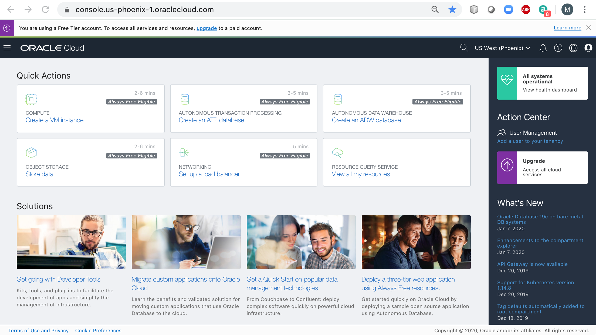
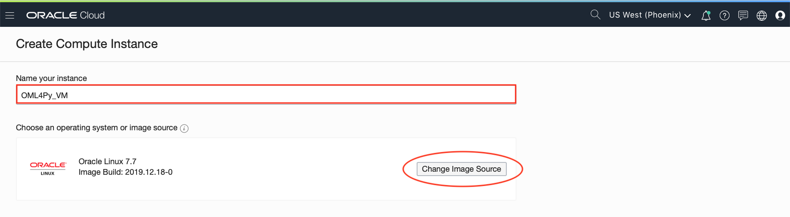

# Setup the Lab Environment

This workshop requires access to a lab Virtual Machine (VM) hosted in Oracle Cloud Infrastructure (OCI). The lab VM is a preconfigured system that comes with preinstalled software to assist with Oracle Machine Learning lab exercises.

The VM is accessed from a local desktop or a laptop through a public IP address using Microsoft Remote Desktop software.

Follow the steps outlined in this lab to setup your lab environment.

>If this is an **instructor-led** workshop, the attendees will be assigned a lab VM by the instructor (one per attendee) and its IP Address and login credentials will be shared.
>
>If this is a **self-paced** workshop, or if you plan on using your own Oracle Cloud tenancy/account, this lab provides instructions for provisioning a lab VM in your tenancy.

## Before You Begin
### Objectives

- (Optionally) Provision the lab VM
- Sign in to the lab VM
- Start the Jupyter Notebook server
- Download the Python Notebooks in the VM

### Requirements
To complete this lab, you need the following :

- A laptop or a desktop with internet connectivity and the required software preinstalled (see **Required Software**)
- One of the following :
    * Access to a lab VM, **OR**
    * Oracle Cloud Infrastructure login credentials

### Required Software

To connect to the lab VM you need a laptop/desktop with the following **Microsoft Remote Desktop** software installed :

**Microsoft Windows hosts :**

- Windows 10, Server 2012 R2, 2016, 8.1

Install the Remote Desktop App from the Microsoft Store using the link :
[https://www.microsoft.com/en-us/store/p/microsoft-remote-desktop/9wzdncrfj3ps](https://www.microsoft.com/en-us/store/p/microsoft-remote-desktop/9wzdncrfj3ps)

- Windows 7, Server 2008 R2

Use the built-in Remote Desktop Connection application and apply the updates :

[https://support.microsoft.com/en-us/help/2830477/update-for-remoteapp-and-desktop-connections-feature-is-available-for](https://support.microsoft.com/en-us/help/2830477/update-for-remoteapp-and-desktop-connections-feature-is-available-for)

**macOS, Mac OS X hosts :**

- Install Microsoft Remote Desktop 10 from the App Store

## **STEP 1** :  Provision the Lab VM

**IMPORTANT!! Please skip this step and proceed directly to STEP 2 if you were provided access to a lab VM**

### Sign in to Oracle Cloud Infrastructure

Sign in to the **Oracle Cloud Infrastructure Console** using the following steps.

>**Note :** Your sign in instructions may be different, especially if you have a corporate tenancy, or have a traditional account, or if logging directly to the Oracle Cloud Infrastructure Console.

1. Browse to the Oracle Cloud Infrastructure URL that was provided for your tenancy. For example, you may access your Cloud account from [www.oracle.com](www.oracle.com).

2. From the home page, click on **View Accounts** or , and select **Sign in to Cloud**.


> **Note :** Oracle Cloud Infrastructure supports the following browsers and versions :
> * Google Chrome 69 or later
> * Safari 12.1 or later
> * Firefox 62 or later

3. Enter the **Account Name** that was chosen during sign up. Click **Next**.


4. Enter the **User Name** and **Password** assigned to you and click **Sign In**.


5. You will be taken to **Oracle Cloud Infrastructure** console home page.



### Import the Lab VM Custom Image

Follow the steps outlined below to import the lab VM custom image.

> **Note :** This lab assumes an OCI **Compartment** has been pre created for holding the lab VM assets. If you choose to create a new compartment, follow the instructions outlined [here](https://docs.cloud.oracle.com/en-us/iaas/Content/Identity/Tasks/managingcompartments.htm).

1. Open the top-left Navigation menu in Oracle Cloud Infrastructure console. Under **Compute**, click **Custom Images**.


2. Click **Import Image**.


3. On the **Import Image** dialog box, enter the following :

    * Select the **Compartment** in **CREATE IN COMPARTMENT** that you want to import the image to. In the following screenshot the compartment **OML4PY** is selected but yours may be different.
    * Enter **OML4Py_IMAGE** as the image **NAME**.
    * Select **Linux** as the **OPERATING SYSTEM**.
    * Select **OCI** as the **IMAGE TYPE**
    * Copy/paste the following **OBJECT STORAGE URL** for the lab VM image :

````
<copy>https://objectstorage.us-phoenix-1.oraclecloud.com/n/oraclepartnersas/b/OMLWorkshop/o/OML4Py_IMAGE</copy>
````


4. Click **Import Image**. You will be directed to the **Import Image Details** page. The imported image appears with a status of **IMPORTING**.


5. When the import completes successfully, the status changes to **AVAILABLE**.


>**Note :** If the status doesn't change, or no entry appears in the **Compute** -> **Custom Images**, the import failed. Ensure that you have entered the correct URL for the image and verify if have read access to the custom image object storage bucket.

### Provision the Lab VM

You are now ready to provision the lab VM using the custom image that was just imported.

1. From the Navigation menu in Oracle Cloud Infrastructure console, select **Compute** -> **Instances**.


2. Ensure the correct **Compartment** is selected for the VM.


3. Click **Create Instance**.


4. On the **Create Compute Instance** dialog, enter a name for your instance as **OML4Py_VM** and click **Change Image Source**.



5. On the **Browse Images** dialog, click the **Custom Images** tab, ensure the **Custom Image Compartment** points to the compartment where you have imported the lab VM custom image.

    Select the **OML4Py_IMAGE** image and click **Select Image**.


6. On the **Create Compute Instance** dialog, ensure that a sufficiently sized **Instance Shape** is selected (preferably with 2-4 OCPUs).


7. In the **Configure Networking** section, ensure that **Assign a Public IP Address** is selected. Also if you want to associate this VM to a particular **Virtual Cloud Network**, you may select it here, or let the system generate a new VCN.


8. Add your public SSH key in the **Add SSH Keys** section, either by uploading it or copying/pasting. Refer to instructions [here] (https://docs.cloud.oracle.com/iaas/Content/GSG/Tasks/creatingkeys.htm) on creating an SSH key pair.


9. Click **Create** to start the VM provisioning.


10. The instance is displayed on the Console in a **PROVISIONING** state.


11. Expect provisioning to take several minutes before the status updates to **RUNNING**.


12. Note the **Public IP Address** of the instance. You will need this in the next step for the sign in.


13. Click on the **Subnet** to ensure that the VCN Subnet is configured to allow **Microsoft Remote Desktop** traffic.


14. On the **VCN** page, click **Security Lists** to display the security list to which the VM is associated with.


15. Click on the security list to display the **Ingress Rules**.


16. Ensure that you have an **Ingress Rule** that allows port **3389** for this VM. This is the port that **Microsoft Remote Desktop** uses to communicate (default port).


17. Lastly, log in to the VM using the SSH keys that were used and change the password for the **oracle** user. The instructions for accessing the VM using SSH are detailed [here](https://docs.oracle.com/en/cloud/iaas/compute-iaas-cloud/stcsg/accessing-oracle-linux-instance-using-ssh.html#GUID-D947E2CC-0D4C-43F4-B2A9-A517037D6C11).

>**Note :** You may have to give a few minutes for the operating system to boot before you attempt to log in.

## **STEP 2** : Log in to the Lab VM

In this step you need the lab VM's **IP Address**, **User Name** and **Password**.

- **IP Address** : Public IP Address of the VM shared by the instructor, or captured from Oracle Cloud Infrastructure Console if you provisioned the VM in the previous step
- **User Name** : ***oracle***
- **Password** : ***[shared by the instructor]*** or ***[reset by you in STEP 1]***

1. Start **Microsoft Remote Desktop** application from your laptop/desktop.

>**Hint :** if you don't see Remote Desktop in Windows 10, search in the program menu.


>**Note :** For Windows 7 and 2008 R2, you can use **Remote Desktop Connection** application.

2. Add a new desktop connection to the lab VM. Click **+Add** -> **Desktop** in Windows, or, **[+]** -> **Add PC** in Mac.


3. In **Add Desktop** pop-up, enter the lab VM **IP Address** into **PC Name**, as follows :


4. Next, click **[+]** to add a user account, or click **User Account** -> **Add User Account**.


5. Enter the **User Name** and **Password** provided to you for the lab VM. Click **Save**.


6. Click **Save** one more time to save the connection.


7. Connect to the lab VM by **Double-Clicking** the saved connection.


8. Click **Continue** when prompted that the certificate couldn’t be verified.


9. You should now be connected to the VM and the following desktop will be displayed.

>**Note :** If you have issues connecting, check if your firewall is blocking port 3389 as Microsoft Remote Desktop uses this port by default. Also, an active VPN connection does not allow Microsoft Remote Desktop to connect, so you might want to disconnect the VPN as well.


10. If you see the above desktop, you have successfully connected to the lab VM.

## **STEP 3** : Start the Jupyter Notebook Server

Jupyter Notebooks are among the most popular tools for data scientists as they enable the creation and sharing of documents that include reusable machine learning code with rich graphical output - all in a single and integrated environment.

Jupyter notebook enhances data scientist productivity by streamlining the work and allowing collaboration with the team members. Without getting into further details, let's start the Jupyter Notebook server.

1. Start a new Terminal session from the VM desktop by clicking the **Terminal** icon.


2. On the command line, enter the following command to start the Jupyter Notebook server.

````
$ <copy>jupyter notebook</copy>
````

3. Observe that the Notebook server gets started on port 8888.

>**DO NOT CLOSE** the below window as we need to keep the Notebook server running at all times.


4. When you first start the notebook server, your browser will automically start and open the notebook dashboard. The dashboard serves as a home page for the notebook. Its main purpose is to display the notebooks and files in the current directory.


## **STEP 4** : Download the Python Notebooks

1. Start another Terminal session from the VM desktop by clicking the **Terminal** icon.


2. At the prompt, enter the following command to download the latest Python Notebooks from a public bucket in Oracle Cloud Object Storage.

````
$ <copy>wget https://objectstorage.us-phoenix-1.oraclecloud.com/n/oraclepartnersas/b/OMLWorkshop/o/saved_notebooks.tar</copy>
````

3. Unzip the tar file and extract the materials in **~/OML4Py/saved_notebooks** folder.

````
$ <copy>tar -C ~/OML4Py/saved_notebooks -xvf saved_notebooks.tar</copy>
````

4. Verify the lab materials were successfully downloaded.

````
$ <copy>ls -l ~/OML4Py/saved_notebooks</copy>
````

## Summary

You now have a lab environment setup and ready to be used for the remaining labs.
