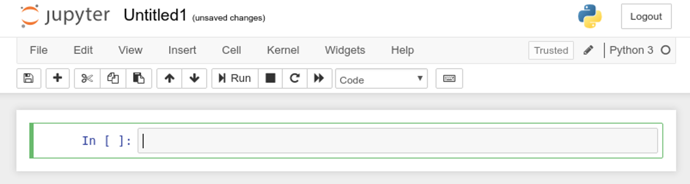
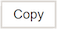
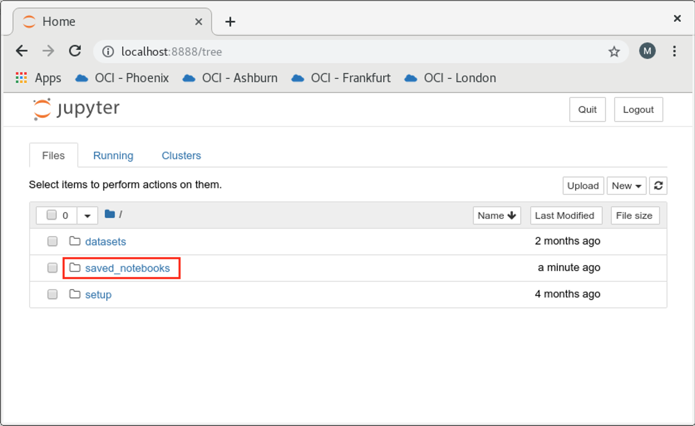

# Using Regression to Predict House Prices

**Regression** models in machine learning are used to predict a continuous value based on a set of features. Regression is mostly used for forecasting a target value (numeric) by formulating its relationship with a set of independent variables. An example of a real-world application of regression is in predicting house prices, given features such as the house size, total rooms, property location, family income, etc., which are the features.

In this lab exercise, you will explore various regression techniques and machine learning algorithms for predicting house prices in the state of California. You will also learn about the methods and optimization techniques involved in preparing the dataset, as not every dataset is a perfectly curated for machine learning. Regression is a type of **Supervised Learning** that requires data that is properly labeled and cleansed to achieve the best accuracy in prediction.

Oracle Database offers a variety of regression techniques in the database such as ridge regression, feature creation and feature selection, on data stored in multiple formats including text and transactional. Performing machine learning in the Database makes available the processing power, memory, and storage capacities of the database server, which is ideally suited for solving high performance and large-scale machine learning problems.

## Before You Begin

### Objectives

This lab will walk you through a complete machine learning solution using a real-world dataset. We’ll attempt to follow a typical machine learning workflow step-by-step :

- Exploratory data analysis
- Data cleaning and formatting
- Feature engineering and selection
- Compare several machine learning models
- Perform hyperparameter tuning on the best model
- Draw conclusions

Along the way, we’ll see how to specifically implement each part in Python and utilize **Oracle Machine Learning for Python** to perform efficient in-Database analysis.

### Requirements

To complete this lab, you need the following account credentials and assets:

- Oracle Cloud Infrastructure Console login credentials and tenancy name
- Public IP Address and login credentials of the lab virtual machine (VM) for the hands-on exercises

## **STEP 0** : Create a New Jupyter Notebook

>**Note** : If like to use a prebuilt Jupyter notebook for this lab (so you don't have to copy/paste commands from this manual), proceed directly to the section **"How to run the lab steps using a pre-built Jupyter Notebook?"** in the **Appendix**.

1. In the lab VM, ensure that the notebook server is started and the dashboard is displayed as follows:


2. Create a new Jupyter notebook. Click on the  button at the top right and select the  kernel from the dropdown as shown below.


3. Or, if you are in another notebook, you need to click **File** -> **New Notebook** -> **Python3** as follows:


4. You will be presented a blank notebook.



5. To use **Oracle Machine Learning for Python**, you must first import the ***oml*** Python module which contains the routines of OML4Py.

>**Note** : The ***oml*** module depends on few other Python modules, including ***cx_Oracle***, which is the module that enables Oracle Database access from Python.

6. Copy the below **"import oml"** Python statement by clicking the  button.

````
<copy>import oml</copy>
````

7. Paste the code in a blank cell of the notebook. Note the cell will be in **Edit mode** when the border is green.


8. Run the statement by clicking the  button. This will run the statement in the box where the cursor is currently active.

9. After the statement is run, a new blank cell created and the cell that was run get a number assigned in square brackets, and the green border moves to the next cell.


10. Unless you plan on using the prebuilt Jupyter notebooks, please continue to use the above method of copying/pasting Python commands from the lab manual to the Jupyter notebook session in the lab VM.

## **STEP 1** : Exploratory Data Analysis

When getting started with **Machine Learning**, it is best to work with real-world data . For this lab you will use the **California Housing Prices** dataset. This data is from the 1990 California census but for the sake of lab purposes we will pretend it is recent data. The data has been slightly altered since it was originally captured, and available for download from [github](https://github.com/ageron/handson-ml/tree/master/datasets/housing). The original dataset and its description is available [here](https://www.dcc.fc.up.pt/~ltorgo/Regression/cal_housing.html). The dataset has been pre-downloaded in the **datasets** folder.

1. Define a Python function **load\_housing\_data** that will load the dataset from the file system into a **Pandas DataFrame** object named **housing**. Run the function to fetch the data in the DataFrame.

````
<copy>import pandas as pd
import os

def load_housing_data():
    file_path = os.path.join("/home/oracle/OML4Py/datasets", "housing", "housing.csv")
    return pd.read_csv(file_path)

housing = load_housing_data()</copy>
````

2. Let's take a look at the top five rows using Pandas DataFrame ***head()*** function. Each row represents one district in the State of California. Observe the various attributes and their values.

````
<copy>housing.head()</copy>
````

>There are 10 attributes in total: **longitude**, **latitide**, **housing\_median\_age**, **total\_rooms**, **total\_bedrooms**, **population**, **households**, **median\_income**, **median\_house\_value**, and **ocean\_proximity**. More details on the data is available [here](https://www.dcc.fc.up.pt/~ltorgo/Regression/cal_housing.htm).

3. The **info()** method provides a quick description of the data, particularly the total number of rows, column names and total columns. Counts of non-null column value, and column data types are returned as well.

````
<copy>housing.info()</copy>
````

>The above dataset has **20640** instances, which is fairly small by ML standards but still very much like real-world data. Note that the **total_bedrooms** has some **null** values as it is populated in **20433** rows (**207** nulls).
>
>All attributes are numerical except **ocean\_proximity** which is a type of Python object. But since the data was loaded from a text file, you can deduce it to be of type **text**.

4. Let's check the data values in the text column **ocean\_proximity** using ***value\_counts()***.

````
<copy>housing["ocean_proximity"].value_counts()</copy>
````

>Note that ocean\_proximity is a categorical attribute and has five unique values or categories, mainly **<1H OCEAN**, **INLAND**, **NEAR OCEAN**, **NEAR BAY**, and **ISLAND**.  The values are categorized based on the geographical area's proximity to the ocean.

5. Let's look at the data distribution for other fields. The ***describe()*** method provides an insight on the attributes especially the numerical attributes.

````
<copy>housing.describe()</copy>
````

> The ***describe()*** function displays **count**, **mean**, **min**, and **max** attributes which are self-explanatory. Note that **null** values are ignored, as evident from **total\_bedrooms** count being **20433** out of **20640** rows (as there are **207** nulls). The **std** deviation is also computed which is the measure of disbursement or the "spread" factor for each attribute.

6. Using **matplotlib**, plot a histogram on the dataframe attributes to get a quick feel of data distribution of the columns. Instead of individually plotting the histogram for each attribute, use the dataframe's ***hist()*** function as it will plot histograms on all numerical columns in a single step.

````
<copy>%matplotlib inline
import matplotlib.pyplot as plt
housing.hist(bins=50, figsize=(20,15))
plt.show()</copy>
````

7. A few items to note in the matplotlib plot :

    - The **median\_income** is scaled to represent ten thousand dollars per measured unit (i.e. a value of 1 means $10k).
    - House prices seems to be capped at **$500k**. This perhaps indicates the data is not that clean.
    - As you notice, many histograms are not balanced. This is indicated when the histogram extends more to the right or left of the median. Machine learning algorithms find it difficult to learn on "tail-heavy" distributions as the "thin extensions" can be anomalies that offset the model. The techniques to transform such distribution in data is discussed later.

8. The housing data contains geographical location information (latitude and longitude) of each district which is best visualized through a scatter plot. Draw a scatter plot using the ***plot()*** function of the dataframe.

````
<copy>housing.plot(kind="scatter", x="longitude", y="latitude")</copy>
````

9. Notice that the plot has the shape of the State of California, which is what the latitudes/longitudes are really for. Let's add some additional details to make the plot more descriptive.

    - Use the transparency marker **alpha=0.2** to emulate the density.
    - Let the radius of the circle represent the district population (using the option "**s**").
    - Let the color of the circle vary by median house prices (using option "**c**").

````
<copy>housing.plot(kind="scatter", x="longitude", y="latitude", alpha=0.2,
    s=housing["population"]/100, label="population", figsize=(9,6),
    c="median_house_value", cmap=plt.get_cmap("jet"))</copy>
````

## **STEP 2** : Load the Dataset into the Oracle Database

The **housing** Pandas DataFrame loaded earlier will now be loaded into the Oracle Database as a table in a predefined Oracle Schema. As explained in an earlier lab, OML4Py allows Python to push a Pandas DataFrame to the Oracle Database, and reference it as an OML DataFrame object, which is a in-memory Python object pointing to the database table, very similar to the Pandas DataFrame.

Follow the below steps to load the dataframe into Oracle.

1. To use OML4Py functions you would first import the **oml** module and then connect to the Oracle Database instance using ***oml.connect()***.

  The oml.connect method establishes a connection to the user’s schema in an Oracle Database instance.

````
<copy>import oml
oml.connect("labuser","labuser", host="localhost", port=1521, service_name="pdb")

oml.isconnected()</copy>
````

**DO NOT PROCEED** further until you see the output from ***oml.isconnected()*** returned as "**True**".

2. Next, you will load the Pandas DataFrame into the Oracle database using the ***oml.create()*** method.

  The oml.create method creates a persistent table in the Oracle Database, versus ***oml.push()*** which creates a Temporary Table in the Database.

  The table in the Oracle Database will be referenced in Python as an **oml.DataFrame** object, which is a pointer to the Database table that can be manipulated in Python as a DataFrame.

>**Note** that OML4Py requires that **NaN** ("Not a Number") in Pandas DataFrame be set to **NULLs** prior to loading the dataframe in Oracle. Alternatively, you can use **oranumber=False** to preserve **NaN** values in the Oracle Table, as shown below.

````
<copy>try:
    oml.drop(table="HOUSING")
except:
    pass

HOUSING = oml.create(housing, table="HOUSING", oranumber=False)</copy>
````

3. Get the dimensions of the OML DataFrame using the ***shape()*** method. As discussed in the earlier labs, most Python functions are overloaded in the **oml** class to transparently work on OML DataFrame objects.

````
<copy>print("Shape:",HOUSING.shape)</copy>
````

4. Double check the column names of the attributes in OML DataFrame.

````
<copy>HOUSING.columns</copy>
````

5. Use the overloaded ***head()*** method on the OML DataFrame to get the first few rows from the database. Note that this method will execute a SQL statement in the database and display the results in the current Python session - keeping all this work transparent and under the covers.

````
<copy>HOUSING.head(5)</copy>
````

6. Use the ***describe()*** method to get statistical details like percentile, mean, stddev, etc. on the OML DataFrame, as you did on the Pandas DataFrame earlier. Use **include=all** to get info on non-numeric columns as well.

````
<copy>HOUSING.describe(include='all')</copy>
````

## **STEP 3** : Build Your First Predictive Model

Ideally at this stage, you would need to prepare the dataset before trying out any ML models. This is to ensure better prediction accuracy. But let's quickly get a sense of the accuracy out of the box and learn on the data in its current state.

### 3.1. Prepare Train/Test Datasets

A simplistic approach for splitting input datasets is to split it randomly; for example, setting aside **80%** for training and **20%** for testing. The ***split()*** function can be used for this as it can divide the OML DataFrame into mutiple sets, based on random sampling.

> A more sophisticated split, such as with stratified sampling, can be used to ensure adequate representation of all predictors in the training/testing set instead of pure random (this is discussed later).

1. Use the ***Split()*** function to split the dataset into two sets, with 80-20 distribution.

````
<copy>TRAIN, TEST = HOUSING.split(ratio = (.8, .2), use_hash = False)</copy>
````

2. After the split, **TRAIN** contains the training data and **TEST** contains the testing data. Validate that the frame was split at 80-20.

````
<copy>print("Original Size :", HOUSING.shape)
print("Train Size    :", TRAIN.shape)
print("Test Size     :", TEST.shape)</copy>
````

3. Separate the target attribute from the predictors. You are going to use all attributes except **median\_house\_value** as the predictors, whereas the target is **median\_house\_value**.

````
<copy>train_x = TRAIN.drop('median_house_value')
train_y = TRAIN['median_house_value']</copy>
````

4. Validate that the target and predictors got properly separated by sampling the first few rows in **train\_x** and **train\_y**.

````
<copy>train_x.head(5)</copy>
````

````
<copy>train_y.head(5)</copy>
````

### 3.2. Build a Predictive Model

Build a **Generalized Linear Regression (GLM)** model using the algorithms powered by **Oracle Advanced Analytics** option of the Oracle Database.

The GLM algorithms are executed in OML4Py using ***oml.glm()***. This class will execute the appropriate algorithms on Oracle based on the **settings** (hyperparameters) provided. The settings are supplied as key-value pairs. Some settings are just general, whereas some are specific to a model or the algorithm. For a complete list of settings, refer to the product documentation.

1. Set the **GLMS\_SOLVER** to **dbms\_data\_mining.GLMS\_SOLVER\_QR** for GLM as a key-value pair. Also let ***oml.glm()*** know that it should focus on **regression** (on of the only two values you can specify, the other being **classification**).

````
<copy># Specify settings for GLM
setting = {'GLMS_SOLVER': 'dbms_data_mining.GLMS_SOLVER_QR'}

# Create an oml GLM model object
glm_mod = oml.glm("regression", **setting)</copy>
````

2. Run the algorithm to generate the model using the ***fit()*** method. Print the model details to understand the model's key statistics, including the **Root Mean Square Error** and **R-Squared**, which it computed on the training set.

> **Root Mean Square Error (RMSE)**: RMSE is a measure of the differences between values predicted by a model and the values observed. In mathematical terms, RMSE is the square root of the arithmetic mean of the squares of a set of values (basically, actual vs predicted), used as a measure of the typical magnitude of a set of numbers, regardless of their sign. A good model should have a low RMSE. But at the same time, a model with very low RMSE has the potential to overfit.
>
> **R-Squared (R^2)**: R^2 is a statistical measure that represents the goodness of fit of a regression model. The ideal value for R^2 is 1. The closer the value of R^2 to 1, the better the model is fitted. So, if the R^2 of a model is 0.50, then approximately half of the observed variation can be explained by the model's inputs.


````
<copy># Fit the GLM model according to training data and parameter settings.
glm_mod = glm_mod.fit(train_x, train_y)

# Show the model details.
glm_mod</copy>
````

3. Locate the values of **ROOT\_MEAN_SQ** and **R\_SQ** from the output, which is the **RMSE** and **R^2** on the **training set**. Note this down as this is the baseline performance of the model.

### 3.3. Predict Using the Model and Calculate Accuracy

1. Remember that 20% of the dataset was saved for testing. Let's now use it to predict the house prices and then calculate RMSE on the test dataset.

````
<copy># Use the model to make predictions on the test data.
res_glm = glm_mod.predict(TEST.drop('median_house_value'), supplemental_cols = TEST[:,['median_house_value']])</copy>
````

2. Calculcate **RMSE** manually on the prediction results on the testing test. Note the RMSE on the testing set is similar to the one observed on the training set.

````
<copy>((res_glm['median_house_value'] - res_glm['PREDICTION']) ** 2).mean() ** .5</copy>
````

3. Calculate the **R^2** on the testing set using the **score()** method. Also note that **R^2** on the testing set is also similar to the one obtained on the training set.

````
<copy>glm_mod.score(TEST.drop('median_house_value'), TEST[:,['median_house_value']])</copy>
````

**Congratulations!** You have successfully created and predicted using your first model.

Now you have some idea on the baseline performance of your very first GLM model. But as mentioned earlier, you would need to normalize and prepare the dataset in order to better the prediction accuracy, as R^2 of 0.64 is not that great for practical purposes.

## **STEP 4** : Preparing the Dataset for ML

Machine Learning algorithms are only as good as the data they learn on. Plus it is well-known that most datasets are inherently flawed. Bad data not only makes the algorithms useless but may even cause harm by predicting wrongfully. Let's apply some of the well known methods to cleanse the CA Housing dataset just loaded.

>**Note** : ML Dataset preparation should also encompass the mechanisms for collecting the "right" data, which is out-of-scope for this lab. It is estimated that almost half of the work in ML is in devising processes to collect and cleanse datasets.

### 4.1. Discovering Correlations

Data correlation in ML is the relationship among the various features or the features with the target variable. If you cannot find any correlation in the dataset then regression is not going help tackle your ML problem.

1. Let's use the built-in ***corr()*** method of the OML dataframe to investigate correlations.

  We are interested in finding correlations only with the target attribute (**median\_house\_value**). The correlation can be positive (an increase in a feature value increases the value of the target variable) or negative (increase in a feature value decreases the value of the target variable).

````
<copy>corr_matrix = HOUSING.corr()
corr_matrix["median_house_value"].sort_values(ascending=False)</copy>
````

>From the correlation results, it is evident that **median\_income** is highly correlated to our target variable **median\_house\_value**. It also shows that other predictors are not that deeply correlated.

2. Correlations can also be visualized graphically. Using Pandas, we can create scatter matrices to visualize trends in data.

  In this step, you will pull the data to a local Pandas DataFrame from the OML Data Frame using the ***pull()*** method and create a **scatter matrix** plot. The pull method creates a local Python object containing a copy of the data from the database that was referenced by the oml object.

>**Note** : The reason for pulling the data from the database into a local Pandas dataframe is to demonstrate the ***pull()*** method of OML4Py.

````
<copy>housing_local = HOUSING.pull()

from pandas.plotting import scatter_matrix

attributes = ["median_house_value", "median_income", "total_rooms", "housing_median_age"]
scatter_matrix(housing_local[attributes], figsize=(20, 12))</copy>
````

3. From the scatter plots notice that **median\_house\_value** to **median\_income** plot seems to be the most correlated (second from right on the top row) - thereby confirming the results of ***corr()*** earlier.

  Zoom into this correlation and scatter-plot the relationship using ***plot()*** and **kind="scatter"**. The plot confirms that the correlation is indeed strong. Also, you can clearly see the house value cap of about **$500k** which is evident from the horizontal line on the top (remember we saw this earlier as well).

  In a real scenario you would want to either remove those records or re-capture real data via some other means in order to get accurate predictions. We will take care of this in a later step.

````
<copy>housing_local.plot(kind="scatter", x="median_income", y="median_house_value", alpha=0.1)</copy>
````

### 4.2. Combining and Deriving Attributes

The dataset contains an attribute called **total\_rooms** which is summarized at the district level. So are the attributes **total\_bedrooms** and **population**. These attributes by themselves don't say much about other predictors or the target variable, and this was evident by the ***corr()*** function earlier.

It is always good to experiment with different combinations or derivatives of the predictors that makes better sense on the data.

1. Let's add three new attributes - **total\_rooms\_per\_households**, **total\_bedrooms\_per\_rooms**, and **total\_population\_per\_household**, as they will better relate to the target variable.

  Use SQL to add the attributes (columns) directly to the **HOUSING** table. This is possible in Python via ***oml.cursor()*** and the ***execute()*** method. These attributes will be populated based on the existing attributes as follows:

    - rooms\_per\_household = total\_rooms/households
    - bedrooms\_per\_rooms = total\_bedrooms/total\_rooms
    - population\_per\_household = population/households

>***oml.cursor()*** function can create a **cx\_Oracle** cursor object for the current database connection. You can use the cursor to execute queries against the database.
>
>**cx\_Oracle** is a Python extension module that enables access to Oracle Database - OML4Py uses cx_Oracle under the covers.

````
<copy>cr = oml.cursor()

try:
    cr.execute("ALTER TABLE housing DROP (\"rooms_per_household\", \"bedrooms_per_rooms\", \"population_per_household\")")
except:
    pass

cr.execute("ALTER TABLE HOUSING add (\"rooms_per_household\" BINARY_DOUBLE, \"bedrooms_per_rooms\" BINARY_DOUBLE, \"population_per_household\" BINARY_DOUBLE)")
cr.execute("UPDATE housing SET \"population_per_household\" = \"population\"/\"households\", \"rooms_per_household\" = \"total_rooms\"/\"households\", \"bedrooms_per_rooms\" = \"total_bedrooms\"/\"total_rooms\"")
cr.execute("COMMIT")
cr.close()</copy>
````

2. Using ***oml.sync()***, synchronize the metadata changes just made to the database table (**HOUSING**) with the Python OML object that was pointing to it (also named **HOUSING**).

  This step is important as the OML object metadata does not automatically sync up when the underlying database object is changed.

````
<copy>HOUSING=oml.sync(table="HOUSING")</copy>
````

3. Check the correlations on **median\_house\_value** one more time.

````
<copy>corr_matrix = HOUSING.corr()
corr_matrix["median_house_value"].sort_values(ascending=False)</copy>
````

4. You now see some interesting correlations. Looks like the new attribute **bedrooms\_per\_rooms** is better correlated with the target than **total\_bedrooms**. Seems like the home buyers prefer more rooms to be complete bedrooms and are willing to pay a higher price for it.

  Also, the number of **rooms\_per\_household** is more correlated with the target when compared to **total\_rooms**. This means a large family is willing to pay a higher price for a bigger house.

5. Since the **median\_income** is a continuous attribute it cannot be directly used as an attribute for stratified sampling (stratified sampling is explained later). However, a new attribute can be "derived" from median\_income that is discrete - for example an income category that groups the median income into buckets with a low and a high range. Looking closely at the histogram from previous step, most median incomes are clustered mainly between 1.5 and 6 (i.e. $15k - $60k), while a few values go beyond 6.

  Add **INCOME\_CAT** attribute to the original dataset which was loaded in the Database. Use SQL and run it directly in Python using ***oml.cursor()*** and the **execute** method, as follows:

````
<copy>cr = oml.cursor()

try:
    cr.execute("ALTER TABLE housing DROP (income_cat)")
except:
    pass

cr.execute("ALTER TABLE HOUSING add (income_cat BINARY_DOUBLE)")
cr.execute("UPDATE housing SET income_cat = (CASE WHEN CEIL(\"median_income\"/1.5) > 5 THEN 5 ELSE CEIL(\"median_income\"/1.5) END)")
cr.execute("COMMIT")
cr.close()</copy>
````

6. Using ***oml.sync()***, synchronize the metadata changes just made on the database with the Python oml object.

````
<copy>HOUSING=oml.sync(table="HOUSING")</copy>
````

7. Using ***oml.graphics()***, plot a histogram for **INCOME\_CAT** and observe the five categories (or buckets) created and the counts per category.

````
<copy>oml.graphics.hist(HOUSING["INCOME_CAT"], bins=10, color='red', linestyle='solid', edgecolor='black')</copy>
````

### 4.3. Encoding Text Attributes

The **ocean\_proximity** attribute contains categorical data of type **text** which needs to be encoded to numeric, this is because most ML algorithms only work with numbers. Categorical data are variables that contain label values rather than numeric values where the number of possible values are often limited to a fixed set.

There are a few methods for encoding text to numeric for categorical attributes, the two most common being **ordinal encoding** and **one-hot encoding**.

  * **Ordinal Encoding** : Encode the string labels of categories to integer values, one unique value per category and replace the exiting attribute or create a new attribute.

  * **One-hot Encoding** : Create a new binary attribute per category. The new attribute for the category will be a '1 (or hot)' when the original row contains the category value. For example, if you have categorical data for colors with three possible colors (e.g. red, blue, green) allowed in an attribute named **color**, you would create 3 new attributes, one for each color, and the value for the new attribute will be '1' for the row where the color existed in original **color** attribute.

1. If we zoom in on the feature "**ocean\_proximity**", we can identify 5 categories, namely **1H OCEAN**, **INLAND**, **NEAR OCEAN**, **NEAR BAY** and **ISLAND**.

````
<copy>HOUSING.crosstab('ocean_proximity').sort_values('count', ascending=False)</copy>
````

2. Add five (5) new attributes of type numeric to the **HOUSING** table, with each attribute representing one category of **ocean\_proximity**. Basically, add new attribute (column) for "**NEAR OCEAN**", an attribute for "**INLAND**" and so on.

  We will use **one-hot encoding** for **ocean\_proximity**. The attribute will be initialized to "1" if the **ocean\_proximity** contains the value that the attribute represents, or "0" if not. For example, when **ocean\_proximity** is "**NEAR OCEAN**" for a particular row, the attribute representing **NEAR OCEAN** (in this case **cat\_near\_ocean**) will be set to "1", otherwise it will be set to "0".

3. Run the following code that uses **oml.cursor()** to one-hot encode **ocean\_proximity** into 5 new columns (**cat\_near\_ocean**, **cat\_inland**, **cat\_island**, **cat\_near\_bay**, and **cat\_1h\_ocean**)

````
<copy>cr = oml.cursor()

drop_sql = ("ALTER TABLE housing DROP (\"cat_1h_ocean\", \"cat_near_ocean\","
           "\"cat_inland\", \"cat_island\", \"cat_near_bay\")")

add_sql = ("ALTER TABLE HOUSING add (\"cat_1h_ocean\" BINARY_DOUBLE,"
           "\"cat_near_ocean\" BINARY_DOUBLE, \"cat_inland\" BINARY_DOUBLE,"
           "\"cat_island\" BINARY_DOUBLE, \"cat_near_bay\" BINARY_DOUBLE)")

update_sql = ("UPDATE housing "
            "SET \"cat_near_ocean\" = (CASE \"ocean_proximity\" WHEN 'NEAR OCEAN' THEN 1 ELSE 0 END),"
            "\"cat_inland\" = (CASE \"ocean_proximity\" WHEN 'INLAND' THEN 1 ELSE 0 END),"
            "\"cat_island\" = (CASE \"ocean_proximity\" WHEN 'ISLAND' THEN 1 ELSE 0 END),"
            "\"cat_near_bay\" = (CASE \"ocean_proximity\" WHEN 'NEAR BAY' THEN 1 ELSE 0 END),"
            "\"cat_1h_ocean\" = (CASE \"ocean_proximity\" WHEN '<1H OCEAN' THEN 1 ELSE 0 END)")

try:
    cr.execute(drop_sql)         
except:
    pass

cr.execute(add_sql)
cr.execute(update_sql)
cr.execute("COMMIT")
cr.close()</copy>
````

4. Using **oml.sync()**, synchronize the newly added columns with the OML DataFrame object.

````
<copy>HOUSING=oml.sync(table="HOUSING")</copy>
````

### 4.4. Data Cleansing

If you remember there were some missing values for **total\_bedrooms** that we found in one of the earlier steps but ignored. If we were to capture the missing information somehow (or remove them from the dataset), it will benefit the ML algorithms as most algorithms are not designed to work with missing values.

The process of filling missing values is called **Imputation**. There are a few ways to accomplish this:

- Remove the affected rows from the dataset.
- Remove the feature(s) with missing values from the dataset.
- Estimate the missing values by setting them, for example, to the attribute's median value.

1. Find out the attributes that have missing values in the **HOUSING** set. From the output below, you will see that **total\_bedrooms** have **20433** values populated out of **20460** total rows. The same goes for **bedrooms\_per\_rooms** as this attribute was derived from **total\_bedrooms**.

````
<copy>HOUSING.describe()</copy>
````

2. Count the missing values (NaN) in **total\_bedrooms** and **bedrooms\_per\_rooms**.

````
<copy>HOUSING[HOUSING['total_bedrooms'] == 'NaN'].crosstab('total_bedrooms').sort_values('count', ascending=False)</copy>
````

````
<copy>HOUSING[HOUSING['bedrooms_per_rooms'] == 'NaN'].crosstab('bedrooms_per_rooms').sort_values('count', ascending=False)</copy>
````

3. Define a function that will modify the missing values (NaN) in **total\_bedrooms** and **bedrooms\_per\_rooms** to their respective **median** values. In machine learning, setting it to median is the preferred transformation method to populate missing data.

  The function **update\_nans()** defined below will take a dataframe and the median values of **total\_bedrooms** and **bedrooms\_per\_rooms** as input, and returns a cleansed dataframe as output.

````
<copy>def update_nans(data, total_bdrms_median, bdrms_per_rooms_median):

    data["total_bedrooms"].fillna(total_bdrms_median, inplace=True)
    data["bedrooms_per_rooms"].fillna(bdrms_per_rooms_median, inplace=True)

    return (data)</copy>
````

4. Calculate the median values of **total\_bedrooms** and **bedrooms\_per\_rooms** on the training set.

````
<copy>total_bdrms_median = HOUSING['total_bedrooms'].median()
bdrms_per_rooms_median = HOUSING['bedrooms_per_rooms'].median()</copy>
````

5. Using embedded Python execution feature of OML4Py, let's run the **update\_nans()** python function inside the database and update the missing values in the training dataset (**TRAIN**).

>**Embedded Python Execution** allows a Python script to execute in one or more Python engines that run on the database server. The engines are dynamically started and managed by Oracle Database. Note that embedded Python execution can return images as well as structured content in the Python API.

6. First, check if embedded Python execution is enabled in the database using ***oml.check.embed()***.

````
<copy>oml.check_embed()</copy>
````

7. Execute the ***oml.table_apply()*** function to apply ***update_nans()*** on the **HOUSING** dataset.

>The ***oml.table_apply()*** function executes a user-defined Python function in an embedded Python session running on the Oracle Database server. With the func parameter, you can supply a Python function or you can specify the name of a script in the Oracle Machine Learning for Python script repository. Script and data repositories are covered in a later lab.

````
<copy>HOUSING=oml.table_apply(data=HOUSING, func=update_nans, func_value=HOUSING, total_bdrms_median=total_bdrms_median, bdrms_per_rooms_median=bdrms_per_rooms_median)</copy>
````

8. Verify the **NaNs** indeed got updated by checking the counts of rows that have **NaNs** in **total\_bedrooms** and **bedrooms\_per\_rooms**. The below statements should return an **Empty DataFrame**.

````
<copy>HOUSING[HOUSING['total_bedrooms'] == 'NaN'].crosstab('total_bedrooms').sort_values('count', ascending=False)</copy>
````

````
<copy>HOUSING[HOUSING['bedrooms_per_rooms'] == 'NaN'].crosstab('bedrooms_per_rooms').sort_values('count', ascending=False)</copy>
````

### 4.5. Remove Outliers

Earlier we saw some tail-heavy distributions of attribute values indicating possible outliers. It is essential to remove these outliers from the training set prior to building any models.

1. Check for outliers in **median\_house\_values** and **population**. This is easily evident through the scatter plot below.

  Note the following outliers - the median\_house\_value is capped at $500k, and the population value of greater than **20,000** per district, evident through the two right-most blue circles but those are only two districts .

````
<copy>housing.plot(kind="scatter", x="population", y="median_house_value", alpha=0.5, s=housing["median_income"]*50, label="population vs median_house_value", figsize=(12,8), c="median_house_value", cmap=plt.get_cmap("jet"))</copy>
````

2. In the training set, get a count of house prices above **$450k**. Observe that rougly **965** districts have their median house prices capped at **$500,001** (most likely outliers) out of about **1025** districts.

````
<copy>HOUSING[HOUSING['median_house_value']>450000].crosstab('median_house_value').sort_values('count', ascending=False).head(10)</copy>
````

3. Remove the outliers discovered in the previous step.

````
<copy>HOUSING=HOUSING[HOUSING['median_house_value']<500001, :]</copy>
````

4. Additionally, there are only a handful districts with population greater than 20k (perhaps outliers). It will be best to remove them as it may skew the results.

````
<copy>HOUSING[HOUSING['population']>20000].crosstab('population').sort_values('count', ascending=False).head(10)</copy>
````

````
<copy>HOUSING=HOUSING[HOUSING['population']<20000, :]</copy>
````

5. Verify the total rows in HOUSING test has now decreased.

````
<copy>HOUSING.shape</copy>
````

6. Let's make a copy of HOUSING as **HOUSING2** and use that to create the training and testing set.

````
<copy>try:
    HOUSING=HOUSING.drop('ocean_proximity')
except:
    pass

housing2=HOUSING.pull()

try:
    oml.drop(table="HOUSING2")
except:
    pass

HOUSING2 = oml.create(housing2, table="HOUSING2", oranumber=False)</copy>
````

### 4.4. Create Train and Test Datasets

In **STEP 3** the split was based on random sampling. This was probably fine if the dataset was large, but for smaller datasets there is a risk of introducing bias in the samples. This is because the split (may) unknowingly favor one predictor over another as it does not take into account the inter-predictor relationships.

**Stratified Sampling** is a technique that samples the data in a way that each sample has a good representation of the whole dataset. It forces each sample to have at least m instances of each class. This approach ensures that one class of data is not overrepresented especially when the target variable is unbalanced.

For stratified sampling to be effective, we need to identify the predictors that highly correlate with the target so we can represent it in the samples without bias. If you remember, we earlier identified that **median\_income** had the most influence on **median\_house\_values**. We therefore need to ensure that the data distribution (histogram) of **median\_income** gets preserved after the split in the training and testing sets.

>The key to coming up with a successful strata is: 1) There should not be too many stratas (or groups), and 2) Each strata should have sufficient number of samples compared within.

1. Using a histogram plot, capture the data distribution of **median\_income** in the dataset prior to the split. The below plot will be referenced later for validation after the stratified split is performed.

  Use ***oml.graphics()*** to plot the histogram (***oml.graphics()*** can also plot a **boxplot**).

````
<copy>import matplotlib.pyplot as plt
oml.graphics.hist(HOUSING['median_income'], bins=50)
plt.show()</copy>
````

2. Since the **median_income** is a continuous attribute it cannot be directly used as an attribute for stratified sampling. However, the derived attribute **INCOME_CAT** can be used as it is discrete.

  Split the dataframe into training and testing sets using the **split()** function with **strata_cols** to indicate that **INCOME_CAT** needs to be included for splitting with stratified sampling.

````
<copy>TRAIN, TEST = HOUSING2.split(ratio = (.8, .2), strata_cols = "INCOME_CAT")</copy>
````

3. After the split, **TRAIN** contains the training data (which is 80% of total) and **TEST** contains the testing data (20% of total).

  Validate that the frame was split at 80-20 for training and testing and note that the training set contains roughly **16k** rows and the testing set **4k** rows.

````
<copy>[split.shape for split in (TRAIN, TEST)]</copy>
````

4. Plot a historgram for **median\_income** from the training and testing sets and compare the shape to the histogram taken over the whole dataset in step **(1)** of this section. Do you see any similarities?

````
<copy>import matplotlib.pyplot as plt
oml.graphics.hist(TRAIN['median_income'], bins=50)
plt.show()</copy>
````

````
<copy>import matplotlib.pyplot as plt
oml.graphics.hist(TEST['median_income'], bins=50)
plt.show()</copy>
````

5. Finally, separate the target attribute from the predictors.

````
<copy># Remove median_house_value for train_x
train_x = TRAIN.drop('median_house_value')

# Initialize train_y for target variable
train_y = TRAIN['median_house_value']</copy>
````

````
<copy># Remove median_house_value for test_x
test_x = TEST.drop('median_house_value')

#initialize test_y for Target variable
test_y = TEST['median_house_value']</copy>
````

## **STEP 5** : Build Predictive Models

There are many different algorithms to choose when approaching a machine learning problem as no one algorithm is best for solving all types of problems. The performance of an algorithm depends on the size and structure of the dataset being analyzed. So the best way to move forward is to test out a few algorithms through a trial-and-error approach, and narrow down one or two algorithms for further tuning.

We’re going to take a look at a few prominent ML algorithms for regression problems for analyzing the CA housing dataset.

### 5.1. Build a Generalized Linear Regression Model

Generalized Linear Model for Regression is a flexible generalization of the linear regression model that allows:

- The target variable to have a non-Guassian distribution
- The features to be dependent on other features
- The features to have a non-linear relationship with the target variable

The word "linear" in GLM does not necessarily require the model to be linear, in fact linear regression is just a special case of GLM that holds linearity. You can find more details on GLM [here](https://en.wikipedia.org/wiki/Generalized_linear_model).

In Step 3, we built a **GLM** model out-of-the-box and got the **RMSE** value of about **70k** and **R-Squared** of about **0.64**. Let's again build the same model, but this time we have better data so we should expect better accuracy.

1. Set the **GLMS\_SOLVER** to **dbms\_data\_mining.GLMS\_SOLVER\_QR** for GLM, and ***oml.glm()*** object as **regression**.

````
<copy># Specify settings.
setting = {'GLMS_SOLVER': 'dbms_data_mining.GLMS_SOLVER_QR'}

# Create an oml GLM model object.
glm_mod = oml.glm("regression", **setting)</copy>
````

2. Run the algorithm to generate the ML model using the **fit()** method. Print the details of the model to get insights, including the **Root Mean Square Error (RMSE)** and **R-Squared**.

````
<copy># Fit the GLM model according to training data and parameter settings.
glm_mod = glm_mod.fit(train_x, train_y)

# Show the model details.
glm_mod</copy>
````

3. Note the value of **ROOT\_MEAN_SQ** now is a bit lower (by about ~10k) than earlier in **STEP 3**. This is better but still not where we like it to be, plus this is for the training set.

  Also note that **R^2** is about the same as before.

4. Let's now predict the house prices and then re-calculate **RMSE** and **R^2** on the test dataset.

````
<copy># Use the model to make predictions on the test data.
res_glm = glm_mod.predict(TEST.drop('median_house_value'), supplemental_cols = TEST[:,['median_income','median_house_value']])</copy>
````

````
<copy>res_glm</copy>
````

5. Calculate RMSE (using the mathematical formula) on the prediction results and also **R^2** using the **score()** function. Notice that they are not much different than what you saw back in **STEP 3**. This means we need to try some other ML method/algorithm for this problem.

````
<copy>((res_glm['median_house_value'] - res_glm['PREDICTION']) ** 2).mean() ** .5</copy>
````

````
<copy>glm_mod.score(test_x, test_y)</copy>
````

### 5.2. Using Gradient Boosting in Regression

Gradient Boosting is another ensemble technique which produces a prediction model that is an "ensemble" of multiple weak prediction models, usually decision trees. This is similar to Random Forest, the difference being the predictors in Gradient Boosting are made sequentially and not independently (using the **boosting** technique), which enables the predictors to learn from the mistakes of previous predictors.

1. For this step, we will use the **GradientBoostingRegressor** class provided by Scikit-learn and run it in the Database using Embedded Python execution.

2. Define a Python function named **gboost\_train()** that will call **GradientBoostingRegressor** to learn, fit, and score the model on the training data. The function returns the gradient boost model and the performance scores, mainly RMSE and R-Squared.

````
<copy>def gboost_train (data, y1):
    from sklearn.metrics import mean_squared_error,r2_score
    from sklearn.ensemble import GradientBoostingRegressor
    import numpy as np

    # Set Hyperparameters
    params = {'n_estimators': 500, 'max_depth': 6,
        'learning_rate': 0.1, 'loss': 'huber','alpha':0.95}

    # Train the algo
    gb_model = GradientBoostingRegressor(**params).fit(data, y1)

    # Predict on the training set
    predictions = gb_model.predict(data)

    # Calculate performance scores
    rmse = np.sqrt(mean_squared_error(y1, predictions))
    r2 = r2_score(y1, predictions)

    # return the model and the scores
    return (gb_model, rmse, r2)</copy>
````

3. Run the function using ***oml.table_apply()*** to invoke embedded python execution feature of the Oracle Database.

````
<copy>retval = oml.table_apply(data=train_x, func=gboost_train, y1=train_y)</copy>
````

4. Print the performance scores on the training set. What do you see?

````
<copy>gboost_model, gboost_rmse, gboost_r2 = retval.pull()

print ('Root Mean Square Error (RMSE) on Testing Set: %.4f' % gboost_rmse)
print ('R-Squared (R^2) on Testing Set: %.4f' % gboost_r2)</copy>
````

5. The performance looks very promising (again) in training, as the case was with Random Forest. But is it due to overfitting the model?

6. Let's crosscheck with testing data. Create another function named **gboost\_test** that will take the model and the testing dataset as input and calculates the performance metrics.

````
<copy>def gboost_test (data, gb_model, y1):
    from sklearn.metrics import mean_squared_error,r2_score
    from sklearn.ensemble import GradientBoostingRegressor
    import numpy as np

    # Predict on the testing set
    predictions = gb_model.predict(data)

    # Calculate performance scores
    rmse = np.sqrt(mean_squared_error(y1, predictions))
    r2 = r2_score(y1, predictions)

    # return the scores
    return (rmse, r2)</copy>
````

7. Run the function using ***oml.table_apply()***.

````
<copy>retval = oml.table_apply(data=test_x, func=gboost_test, gb_model=gboost_model, y1=test_y)</copy>
````

8. Print the performance scores on the testing set. So far this algorithm is giving the best accuracy.

````
<copy>gboost_rmse, gboost_r2 = retval.pull()

print ('Root Mean Square Error (RMSE) on Testing Set: %.4f' % gboost_rmse)
print ('R-Squared (R^2) on Testing Set: %.4f' % gboost_r2)</copy>
````

## Summary

This lab provided an overview on how to approach a machine learning problem using **Oracle Machine Learning for Python**, all the way from data preparation to choosing the appropriate algorithms that works best for the dataset. You have seen that we iteratively identified the ML algorithm that gives the best performance, as usually this is the only approach as it is hard to know in the beginning which algorithm suits the best.

We saw that machine learning is applicable to the task of predicting house prices using available datasets. Using a gradient boosted regressor we were able to predict the scores on the test set to within $40k of the true value, which can be further improved by tuning the parameters.

## Appendix

### How to run this lab using a pre-built Jupyter Notebook?

Follow the below steps if you are short on time and choose to run the labs without copying/pasting the commands from this manual.

1. In the lab VM, ensure that the notebook server is started and the dashboard is displayed as follows:


2. Click on **saved_notebooks** to browse the folder that contains the saved Python notebooks.



> If you are in another notebook, or cannot locate the notebook dashboard, click **File** -> **Open**.
>
>

3. In the **saved-notebooks** folder click on **5-regression-housing-example** lab.

4. You will be presented the notebook for this lab. Run the entire notebook by clicking **Kernel** -> **Restart and Run All**. This will run all executable statements of the notebook (i.e. in the Python statements in the cells).


5. Confirm that you like to **Restart and Run All Cells**. The notebook will take a few minutes to run.


6. After all cells of the notebook successfully complete, you will see that each cell will get a number assigned in square brackets and (optionally) an output will be shown (also ensure there were no errors).

7. You have successfully executed the notebook. You may now go through the notebook steps and inspect the individual commands and their respective outputs.
